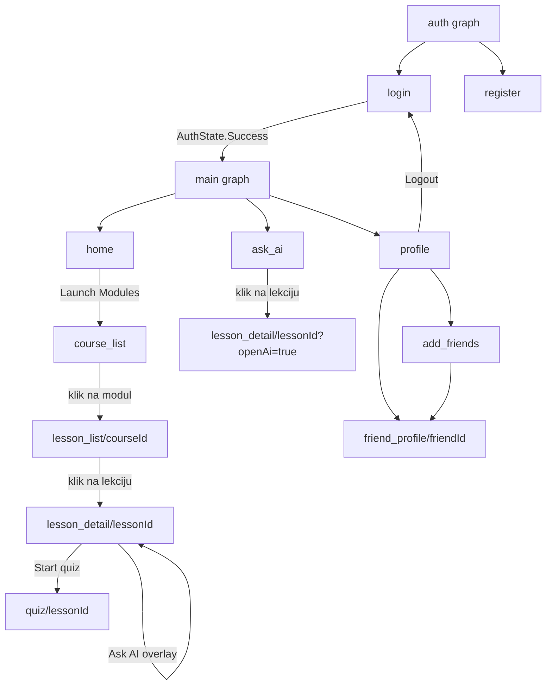

# PROJECT_GUIDE.md — CodePrep

> Vodič kroz projekat za nekoga ko zna osnove Kotlin-a i Android-a,
> ali uči Jetpack Compose. Cilj nije da nabrojimo fajlove, nego da
> razumeš **zašto** nešto postoji, **ko** ga poziva i **kako** podaci
> putuju kroz aplikaciju.

---

## Sadržaj

1. [Project Overview](#1-project-overview)
2. [Project Structure](#2-project-structure)
3. [Project Learning Path](#3-project-learning-path)
4. [Where Does the App Start?](#4-where-does-the-app-start)
5. [Jetpack Compose Crash Course kroz ovaj projekat](#5-jetpack-compose-crash-course-kroz-ovaj-projekat)
6. [Compose vs klasični Android — cheat sheet](#6-compose-vs-klasični-android--cheat-sheet)
7. [Declarative vs Imperative UI](#7-declarative-vs-imperative-ui)
8. [Composable Tree](#8-composable-tree)
9. [Screen-by-Screen analiza](#9-screen-by-screen-analiza)
10. [Trace real flows](#10-trace-real-flows-kroz-aplikaciju)
11. [Jedna akcija, liniju po liniju](#11-jedna-akcija-liniju-po-liniju)
12. [State Management Map](#12-state-management-map)
13. [State Hoisting](#13-state-hoisting)
14. [Recomposition](#14-recomposition)
15. [ViewModel](#15-viewmodel)
16. [Coroutines i Flow](#16-coroutines-i-flow)
17. [Navigation](#17-navigation)
18. [Data Layer](#18-data-layer)
19. [Dependency Injection](#19-dependency-injection)
20. [Šta se dešava kada...](#20-šta-se-dešava-kada)
21. [Najvažniji fajlovi](#21-najvažniji-fajlovi)
22. [End-to-end mape](#22-end-to-end-mape)
23. [Compose mentalni modeli](#23-compose-mentalni-modeli)
24. [Česte zabune pri čitanju ovog projekta](#24-česte-zabune-pri-čitanju-ovog-projekta)
25. [Glossary](#25-glossary)
26. [Finalni mentalni model](#26-finalni-mentalni-model)
27. [Provera znanja (20+ pitanja)](#27-provera-znanja)

---

# 1. PROJECT OVERVIEW

**CodePrep** je Android aplikacija za učenje programiranja u
"gamifikovanom" stilu (slično Duolingo modelu). Korisnik prolazi kroz
**module** (kurseve), unutar svakog modula kroz **lekcije**, a svaka
lekcija se završava **kvizom**. Aplikacija prati napredak kroz XP,
nivoe, srca (hearts), streak i "savršene" (perfect) prolaze.

### Šta aplikacija radi

- **Autentifikacija** — email/password i Google sign-in preko Firebase Auth.
- **Kurikulum sa servera** — moduli, lekcije i pitanja se čuvaju u
  Firebase Firestore, a keširaju lokalno u Room bazi da bi radili offline.
- **Kviz** — pitanja sa jednim tačnim odgovorom; tačan odgovor daje poen,
  netačan oduzima jedno srce; na kraju lekcije dobijaš XP i "zvezdu" ako
  je prolaz savršen.
- **Srca (hearts)** — maksimalno 5; svaki promašaj troši jedno; jedno
  srce se regeneriše svakih 30 minuta. Kada nemaš srca, blokirano je
  pokretanje novih lekcija.
- **Dnevni izazov** — jedno pitanje dnevno na Home ekranu, sa XP nagradom.
- **AI tutor ("Ask AI")** — pitanja vezana za konkretnu lekciju; koristi
  korisnički konfigurisan API ključ (OpenRouter-kompatibilan endpoint).
  Odgovori se keširaju i čuvaju kao konverzacije.
- **Društvene funkcije** — prijatelji, zahtevi za prijateljstvo, profili,
  avatar preseti.
- **Fun fact** — widget na home screen-u telefona + "secret fact" easter
  egg koji se aktivira tresenjem uređaja.
- **Notifikacije i pozadinski rad** — podsetnik za srca, streak podsetnik,
  periodična sinhronizacija sa Firestore-om (WorkManager).

### Tehnologije (stvarno korišćene)

| Oblast | Tehnologija |
| --- | --- |
| Jezik | Kotlin 2.3.x |
| UI | Jetpack Compose + Material 3 (`androidx.compose.bom 2026.02.00`) |
| Navigacija | Navigation Compose (`androidx.navigation:navigation-compose`) |
| DI | Hilt (Dagger) + KSP |
| Lokalna baza | Room (`codeprep_db`, v6) |
| Remote baza | Firebase Firestore |
| Auth | Firebase Auth (email + Google) |
| Mreža (AI) | Retrofit 3 + OkHttp + Gson |
| Async | Kotlin Coroutines + Flow/StateFlow |
| Pozadinski rad | WorkManager (+ Hilt WorkerFactory) |
| Widget | Klasični AppWidget (RemoteViews + `widget_fun_fact.xml`) |
| Lokalizacija | `strings.xml` + `values-sr` + custom `LocalizedText` iz Firestore-a |
| Tajne | `EncryptedSharedPreferences` (AndroidX Security Crypto) |

Bitna činjenica za mentalni model: projekat **nema klasičan XML layout**
ni za jedan ekran. XML postoji samo za widget (`res/layout/widget_fun_fact.xml`),
drawable-e, temu i stringove. Sav UI je napisan Compose-om.

### Glavni delovi sistema

```text
┌─────────────────────────────────────────────────────────┐
│                        UI (Compose)                     │
│  HomeScreen, CourseListScreen, LessonDetailScreen, ...  │
└──────────────────────────┬──────────────────────────────┘
                           │ state (StateFlow) ↓ / eventi ↑
┌──────────────────────────▼──────────────────────────────┐
│                      ViewModel (Hilt)                   │
│  HomeViewModel, LessonViewModel, QuizViewModel, ...     │
└──────────────────────────┬──────────────────────────────┘
                           │ suspend / Flow
┌──────────────────────────▼──────────────────────────────┐
│                      Repository                         │
│  UserRepository, CourseRepository, AiRepository, ...    │
└───────────┬─────────────────────────────┬───────────────┘
            │                             │
┌───────────▼───────────┐     ┌───────────▼───────────────┐
│  Room (lokalno)       │     │  Firestore / Retrofit     │
│  DAO + Entity + Flow  │     │  (remote izvori)          │
└───────────────────────┘     └───────────────────────────┘
```

### High-level mentalni model projekta

```text
Korisnik
   ↓ (tap, unos teksta, shake)
Compose UI (Composable funkcije)
   ↓ callback / viewModel.funkcija()
ViewModel (drži state, pokreće coroutine)
   ↓ suspend poziv / Flow
Repository (odlučuje odakle podaci: Room? Firestore? API?)
   ↓
Room / Firestore / OpenRouter HTTP
   ↓ (rezultat)
ViewModel menja StateFlow
   ↓
collectAsStateWithLifecycle() u Composable-u
   ↓
Recomposition
   ↓
Novi UI
```

Ovaj ciklus ćemo u dokumentu zvati **„petlja“** i pratićemo ga na
svakom ekranu.

---

# 2. PROJECT STRUCTURE

Pregled samo bitnih foldera glavnog modula `app/` (worktrees i `build/`
su izostavljeni jer su kopije/generated kod):

```text
app/src/main/java/com/codeprep/app/
│
├── CodePrepApp.kt                  ← Application klasa (@HiltAndroidApp)
├── MainActivity.kt                 ← jedini "glavni" entry point + RootNavGraph
│
├── data/
│   ├── local/                      ← Room sloj
│   │   ├── CodePrepDatabase.kt     ← @Database definicija (10 entiteta)
│   │   ├── Converters.kt           ← Gson TypeConverter-i za Room
│   │   ├── CodeSnippet.kt
│   │   ├── dao/                    ← UserProgressDao, CourseDao, LessonProgressDao, ...
│   │   └── entity/                 ← UserProgressEntity, LessonProgressEntity, CachedLessonEntity, ...
│   ├── model/                      ← LocalizedText, LessonContentBlock, FunFact
│   ├── remote/api/                 ← OpenRouterApi (Retrofit), AiConfig, EndpointBuilder
│   ├── repository/                 ← UserRepository, CourseRepository, LessonProgressRepository,
│   │                                  AuthRepository(+Impl), AiRepository, FriendsRepository,
│   │                                  FunFactRepository, LessonProgressRules, DailyChallengeParser
│   ├── settings/                   ← AppSettingsStore, AiSettingsStore, AppStringProvider,
│   │                                  DailyChallenge... (u ui/home), PendingSettingsActionHolder
│   ├── friends/                    ← FriendsModels, SocialSearchTerms
│   └── backup/                     ← serijalizacija AI konverzacija (export/import)
│
├── di/                             ← Hilt moduli
│   ├── DatabaseModule.kt           ← Room + DAO provideri
│   ├── FirebaseModule.kt           ← FirebaseAuth + FirebaseFirestore provideri
│   ├── NetworkModule.kt            ← OkHttp + Retrofit + OpenRouterApi
│   └── RepositoryModule.kt         ← @Binds AuthRepository ← AuthRepositoryImpl
│
├── domain/                         ← "domain" deo (bez Android zavisnosti u logici)
│   ├── AiPromptBuilder.kt          ← gradi system prompt za AI na osnovu lekcije
│   └── model/                      ← AiConversationMessage, AiResponse, LessonContext, ...
│
├── feedback/                       ← zvuk + vibracija
│   ├── AppFeedbackManager.kt       ← FeedbackEvent → SoundCue/HapticCue
│   ├── AndroidAppFeedback.kt       ← Android implementacija output-a
│   └── LocalAppFeedback.kt         ← CompositionLocal + ProvideAppFeedback
│
├── notifications/                  ← CodePrepNotificationManager (kanali)
│
├── ui/                             ← SVE što je Compose
│   ├── ai/                         ← AskAiScreen (arhiva), AskAiLessonOverlay (chat), AskAiViewModel
│   ├── auth/                       ← LoginScreen, RegisterScreen, AuthViewModel, GoogleSignIn
│   ├── components/                 ← GamifiedButton, GamifiedTextField, LessonPathNode,
│   │                                  TopBarStats, CodePrepCodeBlock
│   ├── course/                     ← CourseListScreen + CourseViewModel
│   ├── friends/                    ← AddFriendsScreen, FriendProfileScreen, SocialComponents, ViewModels
│   ├── funfact/                    ← FunFactActivity + FunFactViewModel (drugi Activity!)
│   ├── home/                       ← HomeScreen + HomeViewModel + DailyChallengeStateStore
│   ├── lesson/                     ← LessonListScreen, LessonDetailScreen, LessonTooltip, ViewModels
│   ├── localization/               ← localizedStringResource helper + EntryPoint
│   ├── navigation/                 ← Screen (rute), MainNavGraph, AuthNavGraph, CodePrepBottomBar
│   ├── profile/                    ← ProfileScreen, ProfileSettingsViewModel, AiSettingsSection
│   ├── quiz/                       ← QuizScreen + QuizViewModel
│   ├── secretfact/                 ← shake detekcija + overlay (easter egg)
│   └── theme/                      ← Color.kt, Theme.kt, Type.kt
│
├── widget/                         ← FunFactWidgetProvider (RemoteViews, jedini XML layout)
└── work/                           ← WorkScheduler + Workeri (streak, sync, heart, widget)

app/src/main/res/
├── layout/widget_fun_fact.xml      ← JEDINI XML layout u projektu
├── values/strings.xml, values-sr/strings.xml, themes.xml
└── ...
```

### Kako folderi komuniciraju

- `ui/*` nikada direktno ne dira `data/local` niti `data/remote`. Uvek
  ide preko `ViewModel`-a, a ViewModel preko `repository`.
- `di/*` je "lepak": Hilt zna kako da napravi `Room`, `FirebaseFirestore`,
  `OkHttp`, i injektuje ih u repozitorijume, a repozitorijume u ViewModel-e.
- `domain/*` sadrži čiste modele i prompt logiku — nema Android import-a
  (osim u `data/remote/api` DTO-ovima koje AI repository koristi).
- `work/*` i `widget/*` su "izvan" Compose sveta — oni dobijaju podatke
  preko repozitorijuma, ali ih pokreće sistem (WorkManager, AppWidget).

### Mapa zavisnosti

```text
UI (Composable)
 ↓ koristi
ViewModel (@HiltViewModel)
 ↓ koristi
Repository
 ↓ koristi
Room DAO / FirebaseFirestore / OpenRouterApi
```

---

# 3. PROJECT LEARNING PATH

Ovo je preporučeni redosled čitanja. Ne preskači nivoe — svaki sledeći
se naslanja na prethodni.

## Level 0 — Setup i šta je uopšte ovaj projekat

Fajlovi:

- `app/build.gradle.kts`
- `gradle/libs.versions.toml`
- `app/src/main/AndroidManifest.xml`

Šta tražiti: listu dependencies (Compose, Hilt, Room, Firebase, Retrofit),
`minSdk = 29`, i `android:name=".CodePrepApp"` u manifestu.

Cilj: znati da je ovo **single-Activity + više Compose screen-ova** app
(drugi Activity postoji samo za FunFact splash).

## Level 1 — Gde aplikacija počinje

Fajlovi:

- `app/src/main/java/com/codeprep/app/CodePrepApp.kt`
- `app/src/main/java/com/codeprep/app/MainActivity.kt`
- `app/src/main/java/com/codeprep/app/ui/navigation/Screen.kt`

Cilj:

- razumeti kako `Application` klasa inicijalizuje Hilt i sisteme,
- kako `MainActivity.onCreate()` poziva `setContent { }`,
- kako `RootNavGraph` bira početni ekran i postavlja globalni okvir
  (top bar, bottom bar, overlay).

Pre nego što pređeš dalje moraš da razumeš: **zašto `setContent` znači da
ulazimo u Compose svet** i zašto posle toga nema više XML-a.

## Level 2 — Jedan jednostavan Screen

Fajlovi:

- `ui/auth/LoginScreen.kt`
- `ui/auth/AuthViewModel.kt`

Zašto baš Login: najmanji je, ima lokalni state, ViewModel state, callback
i navigaciju posle uspeha. Na njemu možeš da vidiš celu "petlju" u malom.

Cilj:

- razumeti `@Composable`, `Row`, `Column`, `Spacer`,
- kako `Button` dobija `onClick` lambdu,
- kako se rezultat iz ViewModel-a vraća nazad u UI,
- kako `LaunchedEffect(authState)` reaguje na promenu state-a.

## Level 3 — State

Fajlovi:

- `ui/auth/LoginScreen.kt` (polja email/password)
- `ui/home/HomeScreen.kt` (čita `viewModel.uiState`)
- `ui/home/HomeViewModel.kt`

Šta tražiti: `remember { mutableStateOf("") }` u LoginScreen-u vs
`collectAsStateWithLifecycle()` u HomeScreen-u.

Cilj: razumeti razliku između **lokalnog Compose state-a** i
**ViewModel state-a** i kada koji koristiti.

## Level 4 — ViewModel

Fajlovi:

- `ui/home/HomeViewModel.kt`
- `ui/lesson/LessonViewModel.kt`

Šta tražiti:

- `private val _state = MutableStateFlow(...)` i javni `val state = _state.asStateFlow()`,
- `viewModelScope.launch { ... }`,
- konstruktor sa `@Inject` zavisnostima.

Cilj: znati zašto ViewModel preživljava rotaciju ekrana i zašto UI ne
sme sam da poziva bazu ili mrežu.

## Level 5 — Repository

Fajlovi:

- `data/repository/UserRepository.kt`
- `data/repository/LessonProgressRepository.kt`

Šta tražiti: `getUserProgress()` koji vraća `Flow` iz Room-a,
`saveAttempt()` koji radi lokalni upis + best-effort remote push.

Cilj: razumeti zašto ViewModel ne zna da li podatak dolazi iz Room-a,
Firestore-a ili keša.

## Level 6 — Data source (baza i mreža)

Fajlovi:

- `data/local/CodePrepDatabase.kt`
- `data/local/dao/UserProgressDao.kt`
- `data/repository/CourseRepository.kt` (Firestore deo)
- `data/remote/api/OpenRouterApi.kt` i `di/NetworkModule.kt` (AI deo)

Cilj: umeti da ispratiš putanju od `Flow`-a iz Room-a do Firestore
upita i nazad.

## Level 7 — Navigation

Fajlovi:

- `ui/navigation/Screen.kt`
- `ui/navigation/MainNavGraph.kt`
- `ui/navigation/CodePrepBottomBar.kt`
- `MainActivity.kt` (`RootNavGraph`)

Cilj: znati gde je `NavController`, gde je `NavHost`, kako se prosleđuju
argumenti (`lessonId`, `courseId`, `openAi`) i kako se ponaša back.

## Level 8 — Jedan kompletan flow od klika do ponovnog renderovanja

Uzmi tok **kviz odgovor → gubitak srca** ili **lesson → start quiz →
završetak → XP**. Detaljno je opisan u sekciji 10.

Cilj: umeš da otvoriš 5 fajlova i da u njima pratim isti događaj bez
lutanja.

## Level 9 — Napredne teme (kad ti zatrebaju)

- `ui/secretfact/*` — shake senzor + state machine + overlay.
- `work/*` — WorkManager i pozadinsko osvežavanje.
- `widget/*` — klasičan RemoteViews widget (jedini XML layout).
- `data/settings/AiSettingsStore.kt` — EncryptedSharedPreferences.
- `ui/ai/AskAiLessonOverlay.kt` — chat overlay sa Markdown renderom.

---

# 4. WHERE DOES THE APP START?

## Stvarni entry point

Manifest kaže da je launcher Activity `MainActivity`, a `Application`
klasa je `CodePrepApp`:

```xml
<application android:name=".CodePrepApp" ... >
    <activity android:name=".MainActivity" android:exported="true">
        <intent-filter>
            <action android:name="android.intent.action.MAIN" />
            <category android:name="android.intent.category.LAUNCHER" />
        </intent-filter>
    </activity>
</application>
```

Pre nego što `MainActivity` uopšte postoji, Android pravi `Application`
objekat (`CodePrepApp`). Zato je to prvo mesto gde se nešto izvršava:

```kotlin
@HiltAndroidApp
class CodePrepApp : Application(), Configuration.Provider {
    @Inject lateinit var workerFactory: HiltWorkerFactory
    @Inject lateinit var notificationManager: CodePrepNotificationManager
    @Inject lateinit var funFactWidgetUpdater: FunFactWidgetUpdater

    override fun onCreate() {
        super.onCreate()
        notificationManager.createChannels()
        funFactWidgetUpdater.refreshInBackground()
    }
}
```

Šta se ovde dešava:

1. `@HiltAndroidApp` tera Hilt da generiše DI container za celu aplikaciju.
2. `Configuration.Provider` + `HiltWorkerFactory` znači da Worker-i mogu
   da primaju injektovane zavisnosti (`@HiltWorker`).
3. `notificationManager.createChannels()` pravi Android notification kanale.
4. `funFactWidgetUpdater.refreshInBackground()` osvežava fun fact widget.

> Napomena: `MainActivity` **ne poziva** `workScheduler` direktno; pozadinski
> rad se zakazuje iz `SessionBootstrapViewModel` (vidi sekciju 10), a widget
> refresh iz `ProfileSettingsViewModel` i `FunFactActivity`.

## Flow pokretanja aplikacije

```text
Android OS
   ↓
CodePrepApp.onCreate()                (Application, Hilt start)
   ↓
MainActivity.onCreate()
   ↓
enableEdgeToEdge()
requestNotificationPermissionIfNeeded()   (Android 13+, POST_NOTIFICATIONS)
   ↓
setContent { }                        ← ulaz u Compose svet
   ↓
CodePrepTheme { }                     (Material 3 tema, dark)
   ↓
ProvideAppFeedback { }                (CompositionLocal za zvuk/vibraciju)
   ↓
RootNavGraph(pendingSettingsActionHolder)
   ↓
rememberNavController()               (NavHostController)
   ↓
startDestination = if (FirebaseAuth.currentUser != null) "main" else "auth"
   ↓
NavHost(startDestination) {
    authNavGraph(navController)       →  login / register
    mainNavGraph(navController)       →  home / course_list / ...
}
   ↓
Compose bira start destination
   ↓
LoginScreen()  ILI  HomeScreen()
```

### Korak po korak kroz `MainActivity.kt`

**1. `onCreate`**

```kotlin
override fun onCreate(savedInstanceState: Bundle?) {
    super.onCreate(savedInstanceState)
    enableEdgeToEdge()
    requestNotificationPermissionIfNeeded()
    setContent {
        CodePrepTheme {
            ProvideAppFeedback(appFeedback = appFeedback) {
                RootNavGraph(pendingSettingsActionHolder = pendingSettingsActionHolder)
            }
        }
    }
}
```

- `appFeedback` i `pendingSettingsActionHolder` su `@Inject lateinit var` —
  Hilt ih je ubacio pre `onCreate`-a jer je Activity anotirana sa
  `@AndroidEntryPoint`.
- `setContent { }` je ekvivalent `setContentView(R.layout...)`, ali umesto
  XML-a prima **lambda-u koja opisuje UI**.

**2. `RootNavGraph`** (u istom fajlu) je "okvir" cele aplikacije:

- `rememberNavController()` — pravi i pamti `NavHostController`.
- `hiltViewModel()` za `SessionBootstrapViewModel` i `SecretFactViewModel`.
- `currentBackStackEntryAsState()` — pretplata na trenutnu rutu.
- `startDestination` se računa **jednom** (`remember {}`) na osnovu toga
  da li je korisnik prijavljen.
- `NavHost` prikazuje ekran koji odgovara trenutnoj ruti.
- Iznad `NavHost`-a je globalni `TopBarStats` (srca, streak, tajmer), a
  ispod `CodePrepBottomBar` (samo na glavnim rutama).
- Preko svega je `SecretFactOverlay` (easter egg).

## Compose vs klasični Android — ulaz u UI

### Klasični Android (XML + View system)

```kotlin
// stara MainActivity
override fun onCreate(savedInstanceState: Bundle?) {
    super.onCreate(savedInstanceState)
    setContentView(R.layout.activity_main)   // inflate XML → View objekti

    val textView = findViewById<TextView>(R.id.title)  // ili ViewBinding
    textView.text = "Zdravo"

    val button = findViewById<Button>(R.id.button)
    button.setOnClickListener { ... }
}
```

- XML opisuje **strukturu View objekata** koje Android konstruiše.
- Programer posle **ručno dohvata reference** (`findViewById`) i **ručno
  menja** View-e.
- Ekran je "živ" View tree koji ti imperativno ažuriraš.

### Jetpack Compose (ovaj projekat)

```kotlin
override fun onCreate(savedInstanceState: Bundle?) {
    super.onCreate(savedInstanceState)
    setContent {
        CodePrepTheme {
            RootNavGraph(...)
        }
    }
}
```

- Nema inflate-a; nema `findViewById`.
- `setContent` pokreće **kompoziciju**: Compose izvršava Composable
  funkcije i gradi internu strukturu (Composition), a na ekran crta
  ono što funkcije "opišu".
- Kada se state promeni, Compose **sam** ponovo izvršava delove koji
  zavise od tog state-a (recomposition).

Mentalna razlika:

```text
XML svet:    Ti gradiš View tree i ti ga menjaš.
Compose svet: Ti opisuješ kako UI izgleda za dato stanje; Compose
              upoređuje staro i novo i sam menja ekran.
```

Još jedna bitna razlika: u klasičnom svetu navigacija je najčešće
`Activity`/`Fragment` + `FragmentManager`; ovde je **jedna Activity**,
a "ekrani" su Composable funkcije vezane za rute u `NavHost`-u.

---

# 5. JETPACK COMPOSE CRASH COURSE KROZ OVAJ PROJEKAT

Ovo nije generički tutorial — svaki koncept je vezan za stvarni fajl i
stvarni kod iz CodePrep-a.

## Koncept: `@Composable`

### Šta znači

`@Composable` je anotacija koja funkciji daje specijalno značenje:
Compose je može pozvati tokom kompozicije, ona može da čita state i da
poziva druge Composable funkcije. Takve funkcije **ne vraćaju View** —
one samo "opisuju" UI.

### Gde se koristi u projektu

Bukvalno svaki ekran, npr.
`app/src/main/java/com/codeprep/app/ui/home/HomeScreen.kt`:

```kotlin
@Composable
fun HomeScreen(
    viewModel: HomeViewModel = hiltViewModel(),
    onCoursesClick: () -> Unit
) {
    val configuration = LocalConfiguration.current
    val layout = homeScreenLayoutFor(configuration.screenWidthDp)
    val uiState by viewModel.uiState.collectAsStateWithLifecycle()

    HomeScreenContent(
        uiState = uiState,
        layout = layout,
        onExpand = viewModel::expandDailyChallenge,
        onAnswer = viewModel::submitDailyAnswer,
        onComplete = viewModel::completeDailyChallenge,
        onCoursesClick = onCoursesClick
    )
}
```

### Šta se ovde dešava

`HomeScreen` je "pametni" ulaz ekrana: uzima ViewModel, čita state i
prosleđuje sve dalje "glupom" `HomeScreenContent`-u. Sam ne crta skoro
ništa — to je namerno, da bi se UI lako testirao bez ViewModel-a
(vidi `HomeScreenTabletLayoutTest` u `androidTest`).

## Koncept: `setContent`

### Šta znači

`setContent` je funkcija iz `androidx.activity.compose` koja zamenjuje
`setContentView`. Njen argument je `@Composable` lambda — ceo UI svet.

### Gde se koristi u projektu

`app/src/main/java/com/codeprep/app/MainActivity.kt` i
`app/src/main/java/com/codeprep/app/ui/funfact/FunFactActivity.kt`:

```kotlin
setContent {
    CodePrepTheme {
        ProvideAppFeedback(appFeedback = appFeedback) {
            RootNavGraph(pendingSettingsActionHolder = pendingSettingsActionHolder)
        }
    }
}
```

### Šta se ovde dešava

- `MainActivity` je `ComponentActivity` (ne AppCompatActivity — Compose
  ne zahteva AppCompat).
- Sadržaj je ugnježden: tema → feedback provider → navigacija.
- Kada Activity umre, cela kompozicija se uništava.

## Koncept: `Modifier`

### Šta znači

`Modifier` je lanac "ukrasa" i ponašanja nad elementom: padding, size,
background, clickable, clip... Zamena za XML atribute i deo
`LayoutParams`-a. Redosled je bitan: `padding().background()` nije isto
kao `background().padding()`.

### Gde se koristi u projektu

`ui/components/GamifiedButton.kt`:

```kotlin
Box(
    modifier = modifier
        .defaultMinSize(minHeight = height + elevationHeight)
        .clickable(interactionSource = interactionSource, indication = null, enabled = enabled) {
            feedback.emit(FeedbackEvent.TapPrimary)
            onClick()
        }
)
```

i `ui/home/HomeScreen.kt`:

```kotlin
Column(
    modifier = Modifier
        .fillMaxSize()
        .background(AppBackground)
        .verticalScroll(scrollState)
        .padding(horizontal = layout.screenPaddingDp.dp, vertical = 16.dp)
)
```

### Šta se ovde dešava

- `fillMaxSize()` — zauzmi celo roditeljsko mesto.
- `background(...)` — oboj pozadinu.
- `verticalScroll(...)` — dozvoli skrolovanje (bitno: `Column` sam po
  sebi ne skroluje).
- `padding(...)` — unutrašnji razmak.

### Kako bi se ovo radilo u klasičnom Android-u?

```text
Compose:  Modifier.fillMaxSize().background(X).padding(16.dp)
XML:      layout_width=match_parent, layout_height=match_parent,
          android:background="@color/x", android:padding="16dp"
```

Za ponašanja (klik, skrol, transformacije) u XML svetu bi koristio
`OnClickListener`, `ScrollView`, `RecyclerView` itd. — dakle deo stvari
koje `Modifier` objedinjuje tamo je razdvojen na View tipove i listenere.

## Koncept: `Column`, `Row`, `Box`

### Šta znači

Tri osnovna layout kontejnera:

- `Column` — deca idu **vertikalno** (kao `LinearLayout` vertical),
- `Row` — deca idu **horizontalno** (kao `LinearLayout` horizontal),
- `Box` — deca se **preklapaju**, pozicionirana preko `Alignment`-a
  (kao `FrameLayout`).

### Gde se koristi u projektu

`ui/navigation/CodePrepBottomBar.kt` koristi `NavigationBar` (interni
`Row`), `ui/home/HomeScreen.kt` koristi `Column` + `Row` + `Box`:

```kotlin
Box(... contentAlignment = Alignment.TopCenter) {
    Row(modifier = Modifier.width(layout.maxContainerWidthDp.dp), ...) {
        HomeSupportingRail(...)
        HomePrimaryContent(...)
    }
}
```

`GamifiedButton` koristi `Box` da bi nacrtao "senku" ispod dugmeta i
"lice" dugmeta koje se spušta pri pritisku — tri `Box`-a jedan preko
drugog:

```kotlin
Box(modifier = ...clickable...) {
    Box(... align(Alignment.BottomCenter) ...)   // senka
    Box(... align(Alignment.TopCenter).offset(y = topOffset) ...) { Text(...) }
}
```

## Koncept: `LazyColumn` / `LazyRow`

### Šta znači

Lista koja **lenjo** komponuje samo vidljive elemente (kao
`RecyclerView`). `LazyRow` je horizontalna verzija.

### Gde se koristi u projektu

`ui/lesson/LessonDetailScreen.kt`:

```kotlin
LazyColumn(
    modifier = Modifier.fillMaxSize(),
    contentPadding = PaddingValues(bottom = 16.dp),
    verticalArrangement = Arrangement.spacedBy(0.dp)
) {
    item { LessonHeroCard(...) }
    if (contentModel.hasCoreSection) {
        item { LessonCardSegment(...) }
    }
    ...
}
```

`ui/course/CourseListScreen.kt`:

```kotlin
LazyColumn(verticalArrangement = Arrangement.spacedBy(layout.verticalSpacingDp.dp)) {
    items(courses, key = { it.courseId }) { course ->
        ModuleJourneyCard(module = course, layout = layout, onClick = { ... })
    }
}
```

### Šta se ovde dešava

- `item { }` dodaje jedan element; `items(list, key = ...)` dodaje listu.
- `key` pomaže Compose-u da prepozna isti element pri izmeni liste.
- `contentPadding`/`Arrangement.spacedBy` zamenjuju XML atribute i
  `ItemDecoration`.

Napomena: `LazyRow` se u ovom projektu **ne koristi** (nijedan
horizontalni lenji list). Ako bi ti zatrebao — npr. horizont scrol
kartica — koristio bi `LazyRow` na isti način.

### Kako bi se ovo radilo u klasičnom Android-u?

```text
Compose: LazyColumn + items()
Klasično: RecyclerView + LayoutManager + Adapter + ViewHolder + item XML

Compose: item { ... }
Klasično: getItemViewType + onCreateViewHolder + onBindViewHolder
```

Konceptualna razlika: u RecyclerView-u ti **ručno** pišeš Adapter koji
mapira poziciju u ViewHolder i ručno pozivaš `notifyItemChanged`. U
Compose-u samo opišeš listu za dati state; kada se lista promeni,
recomposition ažurira prikaz.

## Koncept: `Scaffold`

### Šta znači

`Scaffold` je Material 3 "kostur" ekrana koji zna gde idu top bar,
bottom bar, FAB, snackbar, i daje ti `PaddingValues`.

### Gde se koristi u projektu

`ui/quiz/QuizScreen.kt`:

```kotlin
Scaffold(
    containerColor = AppBackground,
    topBar = {
        Row(modifier = Modifier.fillMaxWidth().padding(16.dp), ...) {
            Text(text = localizedStringResource(R.string.quiz_hearts, state.userHearts), ...)
            Text(text = localizedStringResource(R.string.quiz_score, state.score, state.questions.size), ...)
        }
    }
) { paddingValues ->
    Column(modifier = Modifier.padding(paddingValues).padding(16.dp).fillMaxSize()) { ... }
}
```

### Šta se ovde dešava

`paddingValues` sadrži "sigurne" margine koje top bar zauzima; bez
`Modifier.padding(paddingValues)` sadržaj bi bio sakriven ispod top bara.

### Compose vs klasični Android

U XML svetu je sličnu stvar radio `CoordinatorLayout` + `AppBarLayout`,
ili bi ručno pravio `LinearLayout` sa header-om. `Scaffold` ne "drži"
View objekte — on samo daje slotove i padding.

## Koncept: `remember`

### Šta znači

`remember` pamti vrednost između recomposition-a unutar jednog
"kompozicionog života" Composable-a. Bez njega bi se lokalna promenljiva
resetovala svaki put kada se funkcija ponovo izvrši.

### Gde se koristi u projektu

`ui/auth/LoginScreen.kt`:

```kotlin
var email by remember { mutableStateOf("") }
var password by remember { mutableStateOf("") }
```

`ui/profile/ProfileScreen.kt`:

```kotlin
var isAvatarSelectorVisible by remember { mutableStateOf(false) }
```

`ui/lesson/LessonDetailScreen.kt`:

```kotlin
val contentModel = remember(activeLesson, language) {
    LessonContentUiModel.from(activeLesson, language)
}
```

Ovde `remember(key)` znači: izračunaj ponovo **samo kada se `activeLesson`
ili `language` promene** — inače vrati keširanu vrednost.

## Koncept: `rememberSaveable`

### Šta znači

Kao `remember`, ali preživljava **rekreaciju Activity-ja** (npr. rotaciju)
jer se vrednost upisuje u `SavedInstanceState`.

### Gde se koristi u projektu

`ui/lesson/LessonDetailScreen.kt`:

```kotlin
var showAiSheet by rememberSaveable { mutableStateOf(startWithAiOpen) }
var isAnalogyExpanded by rememberSaveable(activeLesson.lessonId) { mutableStateOf(false) }
```

`ui/profile/ProfileScreen.kt`:

```kotlin
var expandedSettingsSection by rememberSaveable { mutableStateOf<ProfileSettingsSection?>(null) }
```

### Compose vs klasični Android

```text
Compose: rememberSaveable { mutableStateOf(x) }
Klasično: onSaveInstanceState(Bundle) + ručno čuvanje/vraćanje polja
```

Interesantno: email/password u `LoginScreen` koriste običan `remember`,
pa se **izgube pri rotaciji** — to je svesna (ili bar postojeća) odluka,
i dobra vežba da razlikuješ `remember` od `rememberSaveable`.

## Koncept: `mutableStateOf` i `State`

### Šta znači

`mutableStateOf` pravi "observable" kutiju. Kada se vrednost promeni,
Compose zna koji Composable-i su je čitali i označava ih za recomposition.

### Gde se koristi u projektu

`ui/auth/LoginScreen.kt`:

```kotlin
var email by remember { mutableStateOf("") }
...
GamifiedTextField(
    value = email,
    onValueChange = { email = it },
    ...
)
```

`ui/secretfact/SecretFactOverlay.kt` koristi isti mehanizam za animacije.
Takođe, svaki ViewModel koji koristi `MutableStateFlow` ekvivalentno
obaveštava UI — samo kroz Flow, ne kroz Compose State direktno.

### Compose vs klasični Android

```text
Compose: var text by remember { mutableStateOf("") }
         → promena automatski pokreće recomposition onih koji čitaju `text`

Klasično: private var text = ""
          → promena ne radi ništa; moraš ručno textView.text = text
```

## Koncept: `StateFlow` i `collectAsState` / `collectAsStateWithLifecycle`

### Šta znači

`StateFlow` je "hot" Flow sa trenutnom vrednošću — idealan za držanje
UI state-a u ViewModel-u. `collectAsState...` pretvara Flow u Compose
`State` da bi ga Composable čitao.

`collectAsStateWithLifecycle()` je "pametnija" verzija: prestaje da
kolektuje kada je UI u pozadini (STOPPED), pa štedi resurse.

### Gde se koristi u projektu

`ui/home/HomeScreen.kt`:

```kotlin
val uiState by viewModel.uiState.collectAsStateWithLifecycle()
```

`MainActivity.kt`:

```kotlin
val secretFactUiState by secretFactViewModel.uiState.collectAsStateWithLifecycle()
val currentUserId by bootstrapViewModel.currentUserId.collectAsStateWithLifecycle()
val backStackEntry by navController.currentBackStackEntryAsState()
```

Nasuprot tome, `ui/auth/LoginScreen.kt` i `ui/course/CourseListScreen.kt`
koriste običan `collectAsState()`:

```kotlin
val authState by viewModel.authState.collectAsState()
val courses by viewModel.courses.collectAsState()
```

`collectAsState()` ne prati lifecycle — kolektuje dok je kompozicija
aktivna. Za ekrane koji su kratko na ekranu to je često u redu, ali
preporučena praksa (i ono što većina ekrana u ovom projektu radi) je
`collectAsStateWithLifecycle()`.

### Šta znači `by` u `val uiState by ...`

`by` je Kotlin delegacija: `uiState` se ponaša kao `HomeUiState`, a u
pozadini se poziva `getValue()` na `State<HomeUiState>`. Bez `by` bi
pisao `val uiState: State<HomeUiState> = ...` i onda `uiState.value`.

## Koncept: state hoisting i callback funkcije

### Šta znači

State hoisting = podizanje state-a u roditelja; dete dobija vrednost
kroz parametar i javlja promene kroz callback. Dete ne zna odakle
vrednost dolazi niti šta se sa njom dalje dešava.

### Gde se koristi u projektu

`ui/home/HomeScreen.kt` — `HomeScreenContent` ne zna za ViewModel:

```kotlin
HomeScreenContent(
    uiState = uiState,                    // vrednost dole
    onExpand = viewModel::expandDailyChallenge,   // event gore
    onAnswer = viewModel::submitDailyAnswer,
    onComplete = viewModel::completeDailyChallenge,
    onCoursesClick = onCoursesClick
)
```

I unutar njega `DailyChallengeWidget`:

```kotlin
DailyChallengeWidget(
    dailyState = uiState.dailyChallenge,
    onExpand = onExpand,
    onAnswer = onAnswer,
    onComplete = onComplete
)
```

### Smerovi

```text
        Parent (drži state)
          │         ▲
   value  │         │  event (callback)
          ▼         │
        Child (prikazuje / emituje)
```

### Compose vs klasični Android

U klasičnom pristupu dete-bi bio `Fragment` ili custom `View` koji
sam čita iz baze ili preko listener interfejsa (`interface OnXListener`).
Ovde je interfejs zamenjen **lambda parametrima**, što je lakše za
testiranje i čitanje.

## Koncept: recomposition

Detaljno u sekciji 14. Ukratko: Compose ponovo izvršava Composable
funkcije čiji se ulazi/state promene.

## Koncept: `LaunchedEffect`

### Šta znači

`LaunchedEffect(key)` pokreće coroutine **kada uđe u kompoziciju** i
kada se `key` promeni; automatski se otkazuje kada izađe iz kompozicije.
Koristi se za "side effects" — navigaciju, jednokratne akcije, praćenje
event-a.

### Gde se koristi u projektu

`ui/lesson/LessonDetailScreen.kt` — pretplata na `SharedFlow` event:

```kotlin
LaunchedEffect(Unit) {
    viewModel.startQuizEvent.collectLatest { lessonId ->
        onStartQuiz(lessonId)
    }
}
```

`ui/auth/LoginScreen.kt` — navigacija posle uspešne prijave:

```kotlin
LaunchedEffect(authState) {
    if (authState is AuthState.Success) {
        navController.navigate("main") { popUpTo("auth") { inclusive = true } }
    }
}
```

`ui/quiz/QuizScreen.kt` — zvuk/vibracija posle odgovora i posle prolaza.

`MainActivity.kt`:

```kotlin
LaunchedEffect(currentUserId) {
    if (currentUserId != null) bootstrapViewModel.refreshHeartsOnSessionStart()
}
LaunchedEffect(currentRoute) {
    secretFactViewModel.onRouteChanged(currentRoute)
}
```

### Odgovor na često pitanje

> Da li se `LaunchedEffect` izvršava pri svakoj recomposition?

**Ne.** Izvršava se pri ulasku u kompoziciju i svaki put kada se promeni
`key`. `LaunchedEffect(Unit)` se zato izvrši jednom (dok je na ekranu).
`LaunchedEffect(currentRoute)` se izvrši ponovo samo kada se ruta promeni.

## Koncept: `DisposableEffect`

### Šta znači

Kao `LaunchedEffect`, ali za resurse koje moraš **ručno da zatvoriš**
(listeneri, senzori, registracije). Ima `onDispose { }`.

### Gde se koristi u projektu

`MainActivity.kt`:

```kotlin
DisposableEffect(sensorController) {
    sensorController.start()
    onDispose { sensorController.stop() }
}
```

`SecretFactSensorController` registruje `SensorEventListener` za
akcelerometar; `onDispose` ga odjavljuje da ne curi memorija.

## Koncept: `SideEffect`

Ne postoji u ovom projektu kao eksplicitna upotreba; sve "side effect"
potrebe su rešene kroz `LaunchedEffect` i `DisposableEffect`. Ako naiđeš
na `SideEffect` u drugim projektima, to je za sinhronizaciju
ne-Compose stanja pri svakoj uspešnoj kompoziciji — ovde nije potrebno.

## Koncept: navigacija (`NavHost`, `NavController`, `composable`)

Detaljno u sekciji 17. Ukratko iz `MainActivity.kt`:

```kotlin
val navController = rememberNavController()
...
NavHost(navController = navController, startDestination = startDestination) {
    authNavGraph(navController)
    mainNavGraph(navController)
}
```

`composable(Screen.Home.route) { HomeScreen(...) }` je "mapiranje" rute
na Composable funkciju.

## Koncept: Material Theme

### Gde se koristi u projektu

`ui/theme/Theme.kt`:

```kotlin
MaterialTheme(
    colorScheme = colorScheme,
    typography = typography,
    content = content
)
```

- `CodePrepTheme` je `darkTheme = true` po default-u (Neon Terminal tema).
- Boje: `ElectricCyan`, `Charcoal`, `AppBackground`... (`ui/theme/Color.kt`).
- Tipografija: `AppTypography` i `AppCodeTypography` (`ui/theme/Type.kt`),
  a na tabletima (`screenWidthDp >= 600`) koristi se `AppExpandedTypography`.

Composable-i čitaju temu preko `MaterialTheme.colorScheme`, npr. u
`MainActivity.kt`: `.background(MaterialTheme.colorScheme.background)`.

## Koncept: Preview

U ovom projektu **nema** `@Preview` funkcija (nema `@Preview` anotacija
u `ui/`). Umesto preview-a, koriste se instrumentacioni testovi nad
UI-om (`ui/home/HomeScreenTabletLayoutTest.kt`, `ui/navigation/CodePrepBottomBarTest.kt`).
Ako budeš dodavao preview, dobra mesta su `HomeScreenContent`,
`QuizScreen` i `GamifiedButton`, jer su "glupi" Composable-i bez
ViewModel-a.

---

# 6. COMPOSE VS KLASIČNI ANDROID — CHEAT SHEET

| Jetpack Compose | Klasični Android | Napomena |
| --- | --- | --- |
| `setContent { }` | `setContentView(R.layout.x)` | Compose ne inflate-uje XML |
| `@Composable fun X()` | XML layout + `View` objekti | Compose funkcija ne vraća View |
| `Text("hi")` | `TextView` | `Text` je funkcija, ne klasa |
| `Button(onClick=...)` | `Button` iz XML + listener | nema `findViewById` |
| `BasicTextField` (`GamifiedTextField`) | `EditText` | state dolazi kroz parametre |
| `LazyColumn` | `RecyclerView` | nema Adapter/ViewHolder |
| `Column`/`Row`/`Box` | `LinearLayout`/`FrameLayout` | |
| `Modifier.padding(...)` | `android:padding` | Modifier je lanac |
| `Modifier.clickable { }` | `setOnClickListener` | ponašanje je deo Modifier-a |
| `remember { }` | polje u klasi (npr. u Fragment-u) | preživljava recomposition, ne rotaciju |
| `rememberSaveable { }` | `onSaveInstanceState` | preživljava rotaciju |
| `mutableStateOf` + `State` | ručno ažuriranje View-a | "state-driven UI" |
| `collectAsStateWithLifecycle()` | `LiveData.observe(viewLifecycleOwner)` | lifecycle-aware pretplata |
| `StateFlow` u ViewModel-u | `LiveData` u ViewModel-u | oba su lifecycle-aware/observable |
| state-driven UI | `view.text = ...`, `view.visibility = ...` | ključna razlika |
| recomposition | ručno osvežavanje | Compose radi "diff" |
| `NavHost` + `composable()` | `FragmentContainerView` + Navigation XML | jedna Activity |
| `navController.navigate("ruta")` | `findNavController().navigate(R.id.x)` | rute su stringovi |
| `Scaffold` | `CoordinatorLayout`/`AppBarLayout` | slotovi + padding |
| `MaterialTheme` + `Typography` | `styles.xml`/`themes.xml` | vrednosti kroz CompositionLocal |
| `@HiltViewModel` + `hiltViewModel()` | `ViewModelProvider`/`by viewModels()` | isti ViewModel koncept |
| `Modifier.testTag("x")` | `View.setTag`/`R.id` | koristi se u UI testovima |

Gde poređenje **nije** 1:1:

- `remember` nije isto što i polje u Fragment-u: Fragment preživljava
  rotaciju, `remember` ne.
- `LazyColumn` nije `RecyclerView`: nema Adapter API-ja, nema
  `notifyDataSetChanged`; sve se svodi na listu podataka.
- `Modifier` nije samo "layout params": on nosi i ponašanja, crtanje i
  transformacije.
- `NavHost` nije `FragmentManager`: nema Fragment lifecycle-a; umesto
  toga `NavBackStackEntry` + `SavedStateHandle`.
- Compose funkcije mogu se izvršavati **više puta** i moraju biti
  "idempotentne" po opisu UI-a.

---

# 7. DECLARATIVE VS IMPERATIVE UI

Ovo je możda najvažnija razlika u celom Compose-u.

### Klasični (imperativni) pristup

Programer govori View objektu **šta da uradi**:

```kotlin
if (isLoading) {
    progressBar.visibility = View.VISIBLE
    recyclerView.visibility = View.GONE
} else {
    progressBar.visibility = View.GONE
    recyclerView.visibility = View.VISIBLE
}
bookAdapter.submitList(books)
titleView.text = state.title
```

Mentalni model:

```text
State se promenio
   ↓
Ja (programer) moram da nađem sve View-e
   ↓
Ručno postavim njihova svojstva
```

Ako zaboraviš jednu liniju — UI je nekonzistentan. Ako se stanje
promeni iz dva mesta, možeš da dobiješ "trku" između dva ažuriranja.

### Compose (deklarativni) pristup

Opisuješ **kako UI treba da izgleda za trenutno stanje**:

```kotlin
if (isLoading) {
    CircularProgressIndicator()
} else {
    BookList(books)
}
```

U CodePrep-u to izgleda ovako (`DailyChallengeWidget` u
`ui/home/HomeScreen.kt`):

```kotlin
when {
    dailyState.isLoading -> { /* prikaži loading */ }
    dailyState.isCompleted -> { /* prikaži "completed" */ }
    question == null -> { /* prikaži grešku */ }
    !dailyState.isExpanded -> { DailyChallengePreview(...) }
    else -> { DailyChallengeQuestionContent(...) }
}
```

Ne postoji nijedna linija koja kaže "sakrij ovo, prikaži ono". Postoji
samo opis: *za ovo stanje, UI izgleda ovako*. Kada se state promeni,
Compose ponovo izvrši `when` i sam ukloni/doda elemente.

Isto u `HomeScreenContent`:

```kotlin
if (layout.useSplitLayout) {
    // tablet raspored
} else {
    // telefon raspored
}
```

i u `LessonDetailScreen`:

```kotlin
lesson?.let { activeLesson ->
    // ceo sadržaj lekcije
} ?: if (isLoading) {
    CircularProgressIndicator(color = ElectricCyan)
} else {
    Text(localizedAiString(language, R.string.lesson_message_unavailable), ...)
}
```

### Mentalni model

```text
        STATE
          ↓
  Composable funkcije  (opis UI-a za to stanje)
          ↓
         UI
```

Kada se state promeni:

```text
      NEW STATE
          ↓
     RECOMPOSITION   (ponovno izvršavanje funkcija)
          ↓
     NEW UI OPIS
          ↓
   Compose ažurira ekran
```

### Šta ovo praktično znači za tebe

1. **Nikad ne razmišljaš o View instancama.** Nema `textView`, nema
   `visibility`; postoje samo `Text(...)` i `if`/`when`.
2. **State je jedini izvor istine.** Ako želiš da promeniš UI, promeni
   state.
3. **Redosled deklaracija prati redosled na ekranu** — mnogo lakše za
   čitanje od XML-a.
4. Ako vidiš da se nešto ne ažurira, prvo pitaj: *da li je taj state
   observable (State/StateFlow) i da li ga Composable čita?*

---

# 8. COMPOSABLE TREE

Za svaki glavni ekran, stablo Composable funkcija iz stvarnog koda.

## HomeScreen

```text
HomeScreen
│   ├─ LocalConfiguration.current
│   ├─ homeScreenLayoutFor()          (čista funkcija, testirana)
│   ├─ viewModel.uiState.collectAsStateWithLifecycle()
│   └─ poziva HomeScreenContent
│
└── HomeScreenContent
    │   ├─ rememberScrollState()
    └── Column (verticalScroll)
        ├── [telefon] HeaderSection(nickname)
        ├── [telefon] SystemUptimeSection(days)
        ├── [telefon] DailyChallengeWidget(...)
        │   ├── DailyChallengePreview
        │   │   ├── QuestionMetaRow → ChallengeBadge
        │   │   └── GamifiedButton
        │   └── DailyChallengeQuestionContent
        │       ├── DailyChallengeCodeSnippet → CodePrepCodeBlock
        │       └── GamifiedButton (po opciji)
        ├── [telefon] SystemStatusWidget(level, xp...)
        ├── [telefon] LaunchModulesButton(onCoursesClick)
        │
        └── [tablet] Box → Row
            ├── HomeSupportingRail
            │   ├── HeaderSection
            │   ├── SystemUptimeSection
            │   ├── SystemStatusWidget
            │   └── LaunchModulesButton
            └── HomePrimaryContent
                └── DailyChallengeWidget
```

Parametri i callback-i:

- `HomeScreen(viewModel, onCoursesClick)` — ViewModel je ulaz u podatke,
  `onCoursesClick` dolazi iz navigacije.
- `HomeScreenContent(uiState, layout, onExpand, onAnswer, onComplete,
  onCoursesClick)` — svi podaci i svi eventi kroz parametre.
- `DailyChallengeWidget(dailyState, onExpand, onAnswer, onComplete)` —
  svaki korisnički potez je callback prema gore.

Smer podataka:

```text
HomeScreen  ──uiState──►  HomeScreenContent  ──dailyState──►  DailyChallengeWidget
     ▲                                                              │
     └───────────────── onAnswer: (Int) -> Unit ────────────────────┘
```

## CourseListScreen

```text
CourseListScreen
│   ├─ LocalConfiguration.current
│   ├─ courseListLayoutFor()
│   └─ courses.collectAsState()
│
└── CourseListScreenContent
    ├── Box (testTag "course-list-root")
    │   └── [tablet] Box + width(maxContainerWidth)
    │       └── CourseListContentColumn
    │           ├── Text (title)
    │           ├── Text (subtitle)
    │           └── LazyColumn
    │               └── items(courses) → ModuleJourneyCard
    │                   ├── Row → ModuleIconBubble + Lock/Star/Play ikona
    │                   ├── Text (title)
    │                   ├── Text (description)
    │                   ├── ModuleJourneyCardPills → FlowRow → Pill
    │                   ├── LinearProgressIndicator
    │                   └── Text (status: locked/continue/ready)
    │
    └── [telefon] CourseListContentColumn (isti sadržaj bez Box centriranja)
```

## LessonListScreen

```text
LessonListScreen
│   ├─ uiState.collectAsState()
│   ├─ rememberLessonTooltipState(...)
│   └─ rememberTooltipLayout(...)
│
└── LessonListContent
    └── Box
        ├── [prazno] EmptyLessonState
        ├── Column (verticalScroll)
        │   ├── LessonModuleHeader
        │   └── LessonPathList
        │       └── po lekciji: Box
        │           ├── LessonConnectorPath
        │           └── LessonPathNode(state, onClick, onCirclePositioned)
        └── LessonNodeTooltip (kada je lekcija "prikazana")
            └── GamifiedButton ("Start")
```

Ovde nema `LazyColumn`-a — lista lekcija je kratka, pa običan
`Column` + `verticalScroll` je dovoljan. `LessonPathNode` je custom
Composable koji crta "Duolingo" čvor sa `Brush.verticalGradient`,
senkom i animacijom pritiska (`animateDpAsState`).

## LessonDetailScreen

```text
LessonDetailScreen
│   ├─ lesson/courseTitle/lessonProgress/language/isLoading: collectAsState()
│   ├─ showAiSheet: rememberSaveable
│   ├─ LaunchedEffect(Unit) → startQuizEvent.collectLatest → onStartQuiz
│   │
└── Box
    ├── [lesson != null] LazyColumn
    │   ├── item → LessonHeroCard
    │   │   ├── HeroPill (XP)
    │   │   ├── HeroPill (broj pitanja)
    │   │   └── HeroPill (star/passed)
    │   ├── item → LessonCardSegment (Core)
    │   │   └── LessonBodySection (uvod, objašnjenje)
    │   ├── item → LessonCardSegment (Analogy)
    │   │   └── ExpandableLessonSection
    │   ├── item → LessonCardSegment (Example)
    │   │   └── ExampleSection → LessonSnippetBlock → CodePrepCodeBlock
    │   ├── item → LessonCardSegment (AntiPattern)
    │   │   └── ExpandableLessonSection → LessonSnippetBlock
    │   ├── item → LessonCardSegment (CommonMistakes)
    │   │   └── ExpandableLessonSection → BulletList
    │   ├── item → LessonCardSegment (Summary)
    │   │   └── ExpandableLessonSection → BulletList
    │   └── item → Row
    │       ├── GamifiedButton "Start quiz / Retry for star"
    │       ├── GamifiedButton "Ask AI" → showAiSheet = true
    │       └── [quizBlockMessage != null] Text + LaunchedEffect(2500ms) da obriše
    ├── [loading] CircularProgressIndicator
    ├── [nema lekcije] Text "unavailable"
    └── AskAiLessonOverlay(lessonContext, visible = showAiSheet, onDismiss, onOpenSettings)
```

## QuizScreen

```text
QuizScreen
│   ├─ state: collectAsStateWithLifecycle()
│   ├─ QuizFeedbackEffects(state)          ← zvuk/vibracija
│   │
└── Scaffold (topBar = Row: hearts + score)
    ├── [state.finished] AlertDialog
    │   ├── title (perfect/passed/finished)
    │   ├── text (procenat, XP poruke)
    │   └── confirmButton → GamifiedButton "Finish" → onQuizFinished()
    └── Column
        ├── [isLoading] CircularProgressIndicator
        ├── [currentQuestion == null] Text(loadError)
        └── [inače] Text(pitanje)
            ├── [codeSnippet] CodeSnippetBlock
            ├── GamifiedButton za svaku opciju → viewModel.submitAnswer(index)
            └── [isAnswered] GamifiedButton "Next" → viewModel.nextQuestion()
                └── Text (correct / lost heart)
```

## AskAiScreen (arhiva objašnjenja)

```text
AskAiScreen
│   ├─ explanationsUiState, languageCode, hasApiKey: collectAsState()
│   ├─ expandedCourseId / lessonPendingDeletion: rememberSaveable
│   │
└── Column
    ├── Text (naslov)
    ├── Text (podnaslov)
    ├── [!hasApiKey] AskAiLockedCard → onOpenSettings
    └── Box
        ├── [loading] CircularProgressIndicator
        ├── [empty] ExplanationsEmptyState
        └── LazyColumn
            └── items(modules) → ExplanationsModuleCard
                ├── Row (naslov + expand ikona)
                └── [expanded] ExplanationsLessonRow (po lekciji)
                    ├── preview (citat)
                    └── IconButton (delete) → AlertDialog za potvrdu
```

## AskAiLessonOverlay (chat nad lekcijom)

```text
AskAiLessonOverlay (u LessonDetailScreen-u)
│   ├─ uiState, hasApiKey: collectAsState()
│   ├─ question: rememberSaveable(lessonId)
│   ├─ LaunchedEffect(lessonId) → viewModel.bindLesson(context)
│   ├─ LaunchedEffect(messages.size, isLoading, visible) → scroll na dno
│   ├─ BackHandler(enabled = visible)
│   │
└── AnimatedVisibility (fade + scale)
    └── Box/Column
        ├── Header (naslov lekcije, save dugme, close)
        ├── LazyColumn (poruke)
        │   └── ConversationBubble (user/assistant/system) + Markdown
        ├── FlowRow (sugestije)
        └── Row (OutlinedTextField + send)
```

## Auth ekrani

```text
LoginScreen
├─ email/password: remember { mutableStateOf("") }
├─ authState.collectAsState()
├─ rememberGoogleSignInAction(onIdToken, onFailure)
├─ LaunchedEffect(authState) → navigate("main")
└── AuthScreenFrame(showBrand = true)
    ├── Text (naslov)
    ├── GamifiedTextField (email)
    ├── GamifiedTextField (password)
    ├── [error] Text
    ├── GamifiedButton (login) → viewModel.login(email, password)
    ├── GamifiedButton (Google) → launchGoogleSignIn
    └── Row ("Nemaš nalog?" + "Sign up" → navigate(register))
```

## ProfileScreen (skraćeno)

```text
ProfileScreen
├─ progress (SessionBootstrapViewModel), uiState (ProfileViewModel),
│  selectedLanguage/sound/haptics (ProfileSettingsViewModel)
├─ LazyColumn
│   ├── Settings ikona → isSettingsVisible = true
│   ├── AvatarBadge + edit → Avatar selector ModalBottomSheet
│   ├── NeonStatCard ×3 (XP, level, prijatelji)
│   ├── BadgeStrip
│   ├── pendingRequests → RequestCard
│   ├── FriendsCarousel ili EmptyStateCard
│   └── Logout dugme
├── ModalBottomSheet (avatari)
└── ModalBottomSheet (podešavanja)
    ├── Language section
    ├── Feedback section (zvuk/vibracija)
    ├── Conversations section (export/import)
    └── AI section (AiSettingsSection)
```

## Smer podataka i smer događaja (generalno)

```text
                 ┌──────────────────────────────┐
                 │           PARENT              │
                 │  drži state (ViewModel)       │
                 └───────┬───────────────▲───────┘
                         │               │
              state/param│               │ callback
                         ▼               │
                 ┌──────────────────────────────┐
                 │            CHILD             │
                 │  prikazuje, emituje event    │
                 └──────────────────────────────┘
```

Konkretno u projektu:

```kotlin
// parent → child (podaci)
DailyChallengeWidget(dailyState = uiState.dailyChallenge, ...)

// child → parent (event)
GamifiedButton(onClick = { onAnswer(index) }, ...)
```

Ovo je suština **state hoisting**-a: `DailyChallengeWidget` ne zna da
postoji ViewModel; ako želiš da ga testiraš, dovoljno je da mu daš
`DailyChallengeUiState` i lambde.

---

# 9. SCREEN-BY-SCREEN ANALIZA

## 9.1 Home Screen

### Relevantni fajlovi

- `ui/home/HomeScreen.kt` — UI
- `ui/home/HomeViewModel.kt` — state i logika
- `ui/home/DailyChallengeStateStore.kt` — SharedPreferences za dnevni izazov
- `data/repository/CourseRepository.kt` — dohvatanje dnevnog pitanja
- `data/repository/UserRepository.kt` — XP, streak, srca
- `MainActivity.kt` — top bar sa srcima/streak-om (globalno)

### Šta korisnik vidi

Pozdrav sa nadimkom, "uptime" (streak u danima), karticu **Daily
Challenge** sa pitanjem, XP/level progress i dugme "Launch Modules".
Na tabletu (širina ≥ 600dp) isti sadržaj je raspoređen u dve kolone:
levo rail (pozdrav, streak, status, dugme), desno glavni sadržaj
(dnevni izazov).

### Kako ekran nastaje

1. `NavHost` komponuje `composable(Screen.Home.route) { HomeScreen(...) }`.
2. `HomeScreen` poziva `hiltViewModel()` → Hilt pravi `HomeViewModel`.
3. `HomeViewModel.init` poziva `loadDailyChallenge()`.
4. `HomeScreen` čita `uiState` i predaje ga `HomeScreenContent`-u.

### Composable tree

Vidi sekciju 8 (HomeScreen).

### Odakle dolaze podaci

`HomeViewModel.uiState` je `combine` dva izvora:

```kotlin
val uiState = combine(
    if (userId.isBlank()) flowOf(null) else userRepository.getUserProgress(userId),
    dailyChallengeState
) { progress, dailyChallenge ->
    HomeUiState(
        nickname = progress?.nickname ?: appStringProvider.get(R.string.home_default_nickname),
        streak = progress?.streak ?: 0,
        level = progress?.level ?: 1,
        currentLevelXp = xp % XP_PER_LEVEL,
        xpRequiredForNextLevel = XP_PER_LEVEL,
        dailyChallenge = dailyChallenge
    )
}.stateIn(viewModelScope, SharingStarted.WhileSubscribed(5_000), HomeUiState())
```

- `userRepository.getUserProgress(userId)` je **Room Flow** — svaka
  promena u bazi (npr. dodat XP) automatski emituje novu vrednost.
- `dailyChallengeState` je ViewModel-ov `MutableStateFlow` koji se puni
  iz `DailyChallengeStateStore` (keš) i `CourseRepository.getDailyQuestion`
  (Firestore).

### Gde se nalazi state

| State | Gde živi | Tip |
| --- | --- | --- |
| `nickname`, `streak`, `level`, XP | Room (`user_progress` tabela) | `Flow<UserProgressEntity?>` |
| pitanje dnevnog izazova, `isExpanded`, `isAnswered`, `selectedIndex`, `isCompleted` | `HomeViewModel.dailyChallengeState` | `MutableStateFlow<DailyChallengeUiState>` |
| keš pitanja + da li je današnji izazov završen | `DailyChallengeStateStore` | SharedPreferences (Gson) |
| layout spec | `HomeScreen` (lokalno, `LocalConfiguration`) | obična vrednost |

### Ko menja state

- `expandDailyChallenge()` — otvara pitanje (samo ako pitanje postoji
  i nije završeno).
- `submitDailyAnswer(index)` — beleži odabrani indeks i `isAnswered`.
- `completeDailyChallenge()` — zatvara izazov, upisuje streak, dodaje XP.
- Room Flow menja `nickname/streak/level` indirektno kroz `UserRepository`.

### User event-i

- Klik na karticu ili "Open challenge" → `onExpand`.
- Klik na odgovor → `onAnswer(index)`.
- Klik na "Complete" → `onComplete`.
- Klik na "Launch Modules" → `onCoursesClick` → navigacija na `course_list`.

### Šta izaziva recomposition

- Emisija `userRepository.getUserProgress(...)` (npr. posle `addXp`) —
  novi `HomeUiState` → HomeScreen se recomponuje.
- Promena `dailyChallengeState` (npr. `isExpanded`) — kartica menja
  sadržaj (`DailyChallengePreview` → `DailyChallengeQuestionContent`).
- Globalna promena srca/streak-a menja `TopBarStats` u `MainActivity`.

### Navigation

- `onCoursesClick = { navController.navigate(Screen.CourseList.route) }`
  iz `MainNavigation.kt`.
- Home je start destination unutar `main` grafa i prikazuje se posle
  prijave ili ako je korisnik već ulogovan.

### Compose vs klasični Android

Isti ekran u klasičnom svetu bio bi:

```text
HomeFragment
 ├── activity_home.xml (ConstraintLayout/ScrollView)
 ├── HomeViewModel + LiveData<HomeUiState>
 ├── observer { state -> 
 │       greetingText.text = state.nickname
 │       streakText.text = ...
 │       if (state.dailyChallenge.isExpanded) {...} 
 │       adapter.submitList(...) }
 └── RecyclerView za listu (ako postoji)
```

Ključna razlika: u XML svetu bi `observer` **ručno** mapirao state na
View-e i ručno prikazivao/sakrivao delove. U Compose-u se `HomeScreen`
recomponuje i `when` blok sam izabere šta se vidi.

## 9.2 Course List Screen

### Relevantni fajlovi

- `ui/course/CourseListScreen.kt`
- `ui/course/CourseViewModel.kt`
- `data/repository/CourseRepository.kt`
- `data/repository/LessonProgressRepository.kt`

### Šta korisnik vidi

Listu modula ("kartica" po modulu) sa ikonom, opisom, brojem lekcija,
brojem zvezdica, progresom i statusom ("Continue: ..." / "Ready" /
"Locked"). Zaključani moduli se ne mogu kliknuti.

### Odakle dolaze podaci

`CourseViewModel.courses` kombinuje četiri izvora:

```kotlin
val courses = combine(
    courseRepository.getCourses(),          // Room: svi moduli
    courseRepository.getAllLessons(),       // Room: sve lekcije
    lessonProgressRepository.observeProgressForUser(userId),  // Room: napredak
    appSettingsStore.selectedLanguage()     // SharedPreferences: jezik
) { modules, lessons, progress, language ->
    modules.map { module -> buildModuleCard(module, ..., progressByLesson, language) }
}.stateIn(viewModelScope, SharingStarted.WhileSubscribed(5_000), emptyList())
```

`init { viewModelScope.launch { courseRepository.refreshCourses() } }`
osvežava podatke sa Firestore-a, pa Room Flow emituje nove vrednosti i
UI se sam ažurira.

### Ko menja state

- `CourseRepository.refreshCourses()` puni Room (clear + insert).
- `LessonProgressRepository` (preko kviza) menja progres, što menja
  kartice (completed/perfect brojevi, "continue" lekcija).

### Šta izaziva recomposition

Bilo koja od četiri Flow emisije. U praksi najčešće:
- refresh iz Firestore-a → novi moduli/lekcije,
- završen kviz → novi `LessonProgressEntity`.

### Compose vs klasični Android

```text
Compose: LazyColumn + items(courses) + ModuleJourneyCard
Klasično: RecyclerView + CourseAdapter + CourseViewHolder + item_course.xml,
          DiffUtil za listu, ručni click listener po itemu
```

`ModuleJourneyCard` je "glup" Composable: dobija `ModuleCardUi` i
`onClick` — nema pristup ViewModel-u. To je isti princip kao ViewHolder
koji dobija podatke u `onBindViewHolder`, samo bez boilerplate-a.

## 9.3 Lesson List Screen

### Relevantni fajlovi

- `ui/lesson/LessonListScreen.kt`
- `ui/lesson/LessonListViewModel.kt`
- `ui/lesson/LessonPath.kt` (geometrija putanje)
- `ui/lesson/LessonTooltipState.kt` + `LessonTooltip.kt`
- `ui/components/LessonPathNode.kt`

### Šta korisnik vidi

"Duolingo" putanju čvorova po lekcijama: zaključan (sivo), aktivan
(cyan), završen (zeleno), savršen (žuto). Klik na čvor otvara tooltip
sa dugmetom "Start".

### Odakle dolaze podaci

`LessonListViewModel.uiState` kombinuje module, lekcije za dati
`courseId`, progres i srca, pa računa po lekciji:

- `isUnlocked` — prva lekcija u modulu, ili prethodna lekcija completed;
- `isActive` — prva otključana a nezavršena lekcija;
- `isBlockedByHearts` — otključana, ali bez srca i nije completed;
- `canOpen`;
- `progressLabel`.

Logika zaključavanja je u `buildLessonItems()` (i slično u
`CourseViewModel.isLessonUnlocked`).

### Gde se nalazi state

- padajući podaci: Room (moduli, lekcije, progres) + `hearts` iz
  `user_progress`.
- UI-only state: `LessonTooltipState` (koji čvor je pritisnut/prikazan,
  pozicije čvorova i tooltip-a) — `remember`-ovan u Composable-u, ne u
  ViewModel-u, jer je čisto vizuelni state.

### Ko menja state

- ViewModel: `refreshHearts()` (refill prilikom otvaranja ekrana).
- `LessonListScreen`: `tooltipState.onLessonTapped(...)`,
  `tooltipState.dismiss()`.
- Klik na "Start" u tooltip-u → `onLessonClick(lessonId)` → navigacija.

### Navigation

```kotlin
LessonListScreen(
    onLessonClick = { lessonId ->
        navController.navigate(Screen.LessonDetail.createRoute(lessonId))
    }
)
```

`courseId` dolazi iz rute `lesson_list/{courseId}` kroz `SavedStateHandle`
u ViewModel-u.

### Compose vs klasični Android

Tooltip i custom putanja su nešto što bi u XML svetu zahtevalo custom
View (`onDraw`, `onTouchEvent`) ili biblioteku. Ovde su to Composable
funkcije: `LessonPathNode` crta krugove sa gradijentima, a
`LessonNodeTooltip` je poseban Composable pozicioniran `offset`-om.
Lista je običan `Column` + `verticalScroll` (nije `LazyColumn`, jer je
broj lekcija mali).

## 9.4 Lesson Detail Screen

### Relevantni fajlovi

- `ui/lesson/LessonDetailScreen.kt`
- `ui/lesson/LessonViewModel.kt`
- `ui/ai/AskAiLessonOverlay.kt` + `ui/ai/AskAiViewModel.kt`
- `data/repository/CourseRepository.kt`, `LessonProgressRepository.kt`

### Šta korisnik vidi

Karticu sa naslovom lekcije, XP nagradom, brojem pitanja i statusom
(zvezda/passed). Zatim sekcije: uvod, objašnjenje, analogija
(expandable), primeri koda, anti-pattern (expandable), česte greške
(expandable), sažetak (expandable). Na dnu dva dugmeta: "Start quiz" i
"Ask AI".

### Odakle dolaze podaci

`LessonViewModel.init`:

```kotlin
viewModelScope.launch {
    val loadedLesson = courseRepository.getLesson(lessonId)
    _lesson.value = loadedLesson
    _courseTitle.value = loadedLesson?.let { courseRepository.getCourseTitle(it.courseId) }
    _isLoading.value = false
    if (userId.isNotBlank()) userRepository.registerStreakActivity(userId)
}
```

`courseRepository.getLesson(lessonId)` prvo gleda Room keš, pa tek onda
Firestore (`collectionGroup("lessons")`). `lessonProgress` je Flow iz
Room-a filtriran na taj `lessonId`.

### Gde se nalazi state

| State | Gde | Tip |
| --- | --- | --- |
| `lesson` | `LessonViewModel._lesson` | `MutableStateFlow<CachedLessonEntity?>` |
| `courseTitle` | `LessonViewModel._courseTitle` | `MutableStateFlow<String?>` |
| `isLoading` | `LessonViewModel._isLoading` | `MutableStateFlow<Boolean>` |
| `startQuizEvent` | `LessonViewModel` | `MutableSharedFlow<String>` (jednokratni event) |
| `quizBlockMessage` | `LessonViewModel` | `MutableStateFlow<String?>` (privremena poruka) |
| `showAiSheet` | Composable | `rememberSaveable` |
| expanded sekcije | Composable | `rememberSaveable(lessonId)` |
| `LessonContentUiModel` | Composable | `remember(activeLesson, language)` izvedena vrednost |

### Ko menja state

- `onStartQuizClicked()` — proverava srca, hidrira profil, emituje
  `_startQuizEvent` ili postavlja `quizBlockMessage`.
- `userRepository.registerStreakActivity` — menja streak u Room-u.
- `buildAiSummary()` — čista funkcija koja pravi tekst za AI kontekst.
- Expande sekcija menja isključivo Composable state.

### User event-i

- Klik "Start quiz" → provera srca → navigacija na `quiz/{lessonId}`
  (kroz `collectLatest` u `LaunchedEffect`).
- Klik "Ask AI" → `showAiSheet = true`.
- Klik na sekciju → expand/collapse.
- `LaunchedEffect(quizBlockMessage)` automatski briše poruku posle 2.5s.

### Šta izaziva recomposition

- `_lesson` emituje → ceo `LazyColumn` dobija sadržaj.
- `lessonProgress` se promeni (posle kviza) → `LessonHeroCard` pokaže
  zvezdu i dugme postane "Retry for star".
- `showAiSheet` se promeni → `AskAiLessonOverlay` se pojavi/nestane.
- `quizBlockMessage` → poruka se pojavi, pa nestane posle 2.5s.

### Navigation

Ruta: `lesson_detail/{lessonId}?openAi={openAi}`. `openAi` je opcioni
`BoolType` argument sa default `false`; koristi ga `AskAiScreen` da
otvori lekciju sa već otvorenim AI overlay-om.

```kotlin
navController.navigate(Screen.LessonDetail.createRoute(lessonId, openAi = true))
```

### Compose vs klasični Android

U klasičnom svetu: `LessonDetailFragment` + `NestedScrollView` sa više
`LinearLayout` sekcija, `ExpandableLayout` za collapse (ili ručno
`visibility`), a "Ask AI" bi bio dijalog/fragment. Ovde:
`LazyColumn`, `ExpandableLessonSection` (običan `if (expanded)`) i
`AskAiLessonOverlay` (Composable sa `AnimatedVisibility`).

## 9.5 Quiz Screen

### Relevantni fajlovi

- `ui/quiz/QuizScreen.kt`
- `ui/quiz/QuizViewModel.kt`
- `data/repository/LessonProgressRepository.kt` + `LessonProgressRules.kt`
- `data/repository/UserRepository.kt` (srca, XP)
- `feedback/AppFeedbackManager.kt` (zvuk/vibracija)

### Šta korisnik vidi

Top bar: srca i skor. Pitanje, opcije kao dugmići, kao i feedback posle
odgovora (zeleno/crveno). Na kraju dijalog sa rezultatom, zvezdicom i
osvojenim XP-om.

### Kako ekran nastaje

1. Ruta `quiz/{lessonId}` → `QuizViewModel` dobija `lessonId` iz
   `SavedStateHandle`.
2. `init` → `refillHearts`, `registerStreakActivity`, `loadQuestions()`.
3. `loadQuestions()` poziva `courseRepository.getLesson` i
   `getQuestionsForLesson` (Firestore, sa Room kešom za lekciju).

### Gde se nalazi state

`QuizUiState` u `QuizViewModel.quizState` (`MutableStateFlow`), a
`userHearts` se "kombinuje" iz Room Flow-a:

```kotlin
val uiState: StateFlow<QuizUiState> = combine(
    quizState,
    userRepository.getUserProgress(userId)
) { state, user ->
    state.copy(userHearts = user?.hearts ?: 0)
}.stateIn(viewModelScope, SharingStarted.WhileSubscribed(5_000), QuizUiState())
```

Polja: `questions`, `currentIndex`, `selectedIndex`, `isAnswered`,
`score`, `mistakeCount`, `finished`, `passed`, `perfect`, `xpEarned`,
`lessonXpReward`, `perfectBonusXp`, `awardedBaseXp`,
`awardedPerfectBonus`, `userHearts`, `isLoading`, `loadError`.

### Ko menja state

- `submitAnswer(index)` — tačno: `score + 1`; netačno: `mistakeCount + 1`
  i `userRepository.loseHeart(userId)` + `workScheduler.syncHeartReminder`.
- `nextQuestion()` — sledeći indeks ili `completeQuiz()`.
- `completeQuiz()` — `lessonProgressRepository.saveAttempt(...)`,
  `userRepository.addXp(...)`, pa tek onda `finished = true`.

### Šta izaziva recomposition

- Svaki `quizState.update { }` → novi `QuizUiState` → `QuizScreen` se
  recomponuje.
- `userHearts` se promeni → top bar prikaže nova srca.
- `finished` → `AlertDialog`.

### Feedback efekti

`QuizFeedbackEffects(state)` koristi `LaunchedEffect(answeredKey)` i
`LaunchedEffect(completionKey)` da emituje `Success`/`Error`/`Reward`.
`answeredKey` se računa iz `currentIndex` + `selectedIndex` + `isAnswered`,
tako da se zvuk ne ponavlja na svakoj recomposition — samo kada se
stvarno promeni odgovor.

### Navigation

- Dolazak: `navController.navigate(Screen.Quiz.createRoute(lessonId))`
  iz `LessonDetailScreen`.
- Odlazak: `onQuizFinished = { navController.popBackStack() }` —
  vraća na `LessonDetailScreen`, koji sada čita novi progres iz Room-a
  i prikazuje zvezdu.

### Compose vs klasični Android

Klasično: `QuizFragment` + XML, `RecyclerView` za opcije (ili dinamički
dodati `Button`-i), `observer` koji menja boje i `AlertDialog`. Ovde:
`question.options.forEachIndexed { index, optionText -> GamifiedButton(...) }`,
boje se računaju kroz `getButtonColor(isAnswered, isCorrectAnswer, isSelected)`,
a `if (state.isAnswered)` prikazuje ostatak.

## 9.6 Ask AI (arhiva) i Ask AI overlay

### Relevantni fajlovi

- `ui/ai/AskAiScreen.kt` — lista sačuvanih objašnjenja po modulu
- `ui/ai/AskAiLessonOverlay.kt` — chat overlay nad lekcijom
- `ui/ai/AskAiViewModel.kt`
- `data/repository/AiRepository.kt`
- `data/remote/api/OpenRouterApi.kt`, `EndpointBuilder.kt`, `AiConfig.kt`
- `di/NetworkModule.kt`
- `data/settings/AiSettingsStore.kt`

### Šta korisnik vidi

`AskAiScreen` je "biblioteka" sačuvanih konverzacija: moduli → lekcije
koje imaju sačuvano objašnjenje, sa preview-om. Ako API ključ nije
podešen, vidi `AskAiLockedCard` i dugme ka podešavanjima.

`AskAiLessonOverlay` je pravi chat: istorija poruka (user/assistant/
system), input, dugme za slanje, dugme za čuvanje konverzacije i
Markdown render odgovora.

### Kako ekran nastaje

- `AskAiScreen` čita `explanationsUiState` koji kombinuje Room tokove
  (`getCourses`, `getAllLessons`) i `savedConversations` iz
  `conversationDao.observeConversationSummaries`.
- `AskAiLessonOverlay` dobija `LessonContext` (lessonId, courseTitle,
  lessonTitle, theorySummary) iz `LessonDetailScreen`-a i poziva
  `viewModel.bindLesson(context)`.

### Tok jednog pitanja

```text
Korisnik otkuca pitanje
   ↓
AskAiLessonOverlay.onSend → viewModel.ask(question)
   ↓
AskAiViewModel: provere (prazno pitanje, hasApiKey, cooldown 5s, context)
   ↓
uiState += user poruka, isLoading = true
   ↓
viewModelScope.launch → aiRepository.askQuestion(userId, question, context, istorija)
   ↓
AiRepository: 
   1. keš provera (30 dana, key = user+question+lessonId)
   2. dnevni limit (AiConfig.MAX_QUESTIONS_PER_DAY)
   3. AiPromptBuilder.buildSystemPrompt(context)
   4. api.askQuestion(url = EndpointBuilder.build(baseUrl), request = AiRequest(...))
   ↓
Retrofit/OkHttp → POST {baseUrl}/chat/completions  (Bearer API key)
   ↓
AiApiResponse.choices[0].message.content
   ↓
cacheDao.cacheAnswer(...)  (Room)
   ↓
AiResponse.Success / RateLimited / Fallback / Error
   ↓
AskAiViewModel.applyResponse → uiState += assistant/system poruka, isLoading = false
   ↓
Recomposition → prikaz odgovora
```

Ako mreža padne, `AiRepository` prvo pokušava "stale" keš (bilo kad), pa
`AiResponse.Fallback(context.theorySummary)` (teorija lekcije), pa tek
onda grešku. Zato korisnik skoro uvek dobije neki koristan odgovor.

### Gde se nalazi state

| State | Gde | Tip |
| --- | --- | --- |
| `messages`, `isLoading`, `canSave`, `isSaved` | `AskAiViewModel._uiState` | `MutableStateFlow<AskAiUiState>` |
| `hasApiKey` | `AiSettingsStore` preko `apiKey()` Flow-a | `StateFlow<Boolean>` |
| `savedConversations` / `explanationsUiState` | Room + mapiranje | `StateFlow` |
| konverzacije i poruke | Room (`ai_conversations`, `ai_conversation_messages`) | Entity tabele |
| API key / model / base URL | `EncryptedSharedPreferences` | `AiSettingsStore` |

### Compose vs klasični Android

Klasično: `AskAiFragment` + `RecyclerView` sa `MessageAdapter`, ručno
skrolovanje na dno (`scrollToPosition`), `EditText` + `Button`, dijalog
za čuvanje. Ovde: `LazyColumn` + `rememberLazyListState().animateScrollToItem`,
`OutlinedTextField`, a Markdown renderuje `com.mikepenz.markdown`
biblioteka kroz `Markdown(...)` Composable.

## 9.7 Auth ekrani (Login / Register)

### Relevantni fajlovi

- `ui/auth/LoginScreen.kt`, `ui/auth/RegisterScreen.kt`
- `ui/auth/AuthViewModel.kt`
- `ui/auth/AuthScreenFrame.kt`, `ui/auth/GoogleSignIn.kt`
- `data/repository/AuthRepository.kt` + `AuthRepositoryImpl.kt`
- `ui/navigation/AuthNavGraph.kt`

### Šta korisnik vidi

Formu sa poljima i dugmadima, brend na vrhu, greške ispod polja.

### Gde se nalazi state

**Lokalno u Composable-u** (email, password):

```kotlin
var email by remember { mutableStateOf("") }
var password by remember { mutableStateOf("") }
```

**U ViewModel-u** (auth status):

```kotlin
private val _authState = MutableStateFlow<AuthState>(AuthState.Idle)
val authState: StateFlow<AuthState> = _authState.asStateFlow()
```

`AuthState` je sealed class: `Idle`, `Loading`, `Success`,
`Error(message)`.

### Ko menja state

- `viewModel.login(email, password)` → `Loading` → `Success`/`Error`.
- `viewModel.loginWithGoogle(idToken)` — isti obrazac.
- `googleSignInFailed()` — greška bez pokretanja mreže.

### Navigacija posle uspeha

```kotlin
LaunchedEffect(authState) {
    if (authState is AuthState.Success) {
        navController.navigate("main") {
            popUpTo("auth") { inclusive = true }
        }
    }
}
```

`popUpTo("auth") { inclusive = true }` briše ceo auth graf iz back
stack-a, da "Back" ne bi vratio korisnika na login posle prijave.

### Compose vs klasični Android

Klasično: `LoginFragment` + `EditText` + `TextInputLayout` za greške +
`observer` nad `LiveData<AuthState>`, pa `findNavController().navigate`.
Ovde: `GamifiedTextField` drži vrednost kroz `value` + `onValueChange`
(callback), a navigacija je u `LaunchedEffect`.

## 9.8 Profile Screen

### Relevantni fajlovi

- `ui/profile/ProfileScreen.kt`
- `ui/friends/FriendsViewModels.kt` (`ProfileViewModel`, `AddFriendsViewModel`, `FriendProfileViewModel`)
- `ui/profile/ProfileSettingsViewModel.kt`, `AiSettingsViewModel.kt`, `AiSettingsSection.kt`
- `ui/navigation/SessionBootstrapViewModel.kt`
- `data/repository/FriendsRepository.kt`
- `data/settings/AppSettingsStore.kt`, `AiSettingsStore.kt`, `PendingSettingsActionHolder.kt`

### Šta korisnik vidi

Avatar, nadimak, XP/level/prijatelji, bedževe, zahteve za
prijateljstvo, listu prijatelja, logout. Preko ikone zupčanika otvara
bottom sheet sa podešavanjima: jezik, zvuk/vibracija, export/import AI
konverzacija, AI podešavanja (API key, model, base URL).

### Tri ViewModel-a na jednom ekranu

```kotlin
fun ProfileScreen(
    ...
    sessionViewModel: SessionBootstrapViewModel = hiltViewModel(),
    profileViewModel: ProfileViewModel = hiltViewModel(),
    settingsViewModel: ProfileSettingsViewModel = hiltViewModel()
)
```

- `SessionBootstrapViewModel` — XP, level, nickname, srca (iz Room-a).
- `ProfileViewModel` — prijatelji, zahtevi, avatar (preko
  `FriendsRepository`, koji sinhronizuje Firestore).
- `ProfileSettingsViewModel` — jezik, zvuk, vibracija, export/import.

Sva tri su **scoped na ovaj ekran** (hiltViewModel unutar destination-a),
pa se uništavaju kada izađeš iz `profile` rute.

### Deep link iz Ask AI

Kada korisnik na zaključanom AI ekranu klikne "Open settings",
`MainNavGraph.openAiSettings` prvo upiše zahtev u
`PendingSettingsActionHolder`, pa navigira na `Profile`. ProfileScreen
to konzumira:

```kotlin
LaunchedEffect(pendingSettingsActionHolder) {
    val pendingAction = pendingSettingsActionHolder.consume()
    if (pendingAction != null) {
        isSettingsVisible = true
        if (pendingAction.section == PendingSettingsAction.AI_SETTINGS) {
            expandedSettingsSection = ProfileSettingsSection.Ai
        }
    }
}
```

Ovo je primer kako se prenosi "namera" između ekrana bez navigacionih
argumenata — kroz singleton holder.

## 9.9 FunFactActivity (drugi Activity)

`FunFactActivity` je jedini drugi Activity, pokreće ga widget ili
notifikacija. Ona prikazuje "fun fact" i posle 2.2 sekunde (ili klika)
otvara `MainActivity`:

```kotlin
startActivity(
    Intent(this, MainActivity::class.java).apply {
        flags = Intent.FLAG_ACTIVITY_NEW_TASK or Intent.FLAG_ACTIVITY_CLEAR_TASK
    }
)
```

State dolazi iz `FunFactViewModel` → `FunFactRepository` (čita iz keša
koji je napunio `FunFactWidgetUpdater`/worker).

### Compose vs klasični Android

Zanimljivo: ovo je Activity koja je **u potpunosti Compose**, bez XML-a.
U klasičnom svetu bi bila `SplashActivity` sa XML-om i `Handler`-om za
odloženi prelaz; ovde je `LaunchedEffect` + `delay(2200)`.

---

# 10. TRACE REAL FLOWS KROZ APLIKACIJU

Ovo je najvažnija sekcija. Otvori IDE pored dokumenta i prati fajlove.

## Flow 1 — Pokretanje aplikacije do Home ekrana (ulogovan korisnik)

```text
Android OS
  ↓
CodePrepApp.onCreate()
  ↓
MainActivity.onCreate()
  ↓
setContent { CodePrepTheme { ProvideAppFeedback { RootNavGraph(...) } } }
  ↓
rememberNavController()
hiltViewModel<SessionBootstrapViewModel>()
hiltViewModel<SecretFactViewModel>()
  ↓
startDestination = if (FirebaseAuth.currentUser != null) "main" else "auth"
  ↓
NavHost bira "main" → unutar njega startDestination "home"
  ↓
composable(Screen.Home.route) { HomeScreen(onCoursesClick = ...) }
  ↓
HomeScreen → hiltViewModel() → HomeViewModel
  ↓
HomeViewModel.init → loadDailyChallenge()
  ↓
uiState = combine(Room user_progress, dailyChallengeState)
  ↓
collectAsStateWithLifecycle() → HomeScreenContent
  ↓
UI: pozdrav, streak, dnevni izazov, XP
```

Korak po korak:

1. **`CodePrepApp.onCreate`** (`CodePrepApp.kt`) — Hilt se inicijalizuje,
   kreiraju se notification kanali i osveži fun fact widget.
2. **`MainActivity.onCreate`** (`MainActivity.kt`) — `enableEdgeToEdge`,
   traženje `POST_NOTIFICATIONS` dozvole (Android 13+), `setContent`.
3. **`RootNavGraph`** — `remember`-uje `startDestination`; Time što je
   `FirebaseAuth.getInstance().currentUser` sinhrona provera znači da
   Compose odmah zna koji graf da prikaže.
4. **`SessionBootstrapViewModel.init`** — dodaje `AuthStateListener`,
   pokreće `syncSessionWorkers` i `refreshSessionData`. Ovo se dešava
   paralelno sa UI-em.
5. **`LaunchedEffect(currentUserId)`** u `RootNavGraph` — kada user id
   postane dostupan, poziva `refreshHeartsOnSessionStart()`.
6. **`NavHost`** komponuje `HomeScreen`.
7. **`HomeScreen`** → `hiltViewModel()` → Hilt konstruktor
   `HomeViewModel(userRepository, courseRepository, dailyChallengeStateStore,
   appStringProvider, auth)`.
8. **`HomeViewModel.init`** → `loadDailyChallenge()` čita keš iz
   `DailyChallengeStateStore`, a ako nema keša zove
   `courseRepository.getDailyQuestion(today)`.
9. **`combine(...)`** emituje prvi `HomeUiState`; `collectAsStateWithLifecycle`
   ga prosleđuje u `HomeScreenContent`.
10. **Recomposition** prikazuje UI. Kada stigne Firestore pitanje ili
    Room progres, UI se sam ažurira.

## Flow 2 — Dnevni izazov: otvaranje → odgovor → završetak → XP + streak

```text
Korisnik klikne karticu / "Open challenge"
  ↓
DailyChallengeWidget: Modifier.clickable(onClick = onExpand)  ILI  GamifiedButton(onClick = onExpand)
  ↓
HomeScreenContent.onExpand → HomeScreen: viewModel::expandDailyChallenge
  ↓
HomeViewModel.expandDailyChallenge()
  ↓
dailyChallengeState.update { it.copy(isExpanded = true) }
  ↓
MutableStateFlow emituje novi state
  ↓
uiState (combine) emituje novi HomeUiState
  ↓
collectAsStateWithLifecycle → recomposition
  ↓
when → DailyChallengeQuestionContent (prikaz pitanja i opcija)

Korisnik klikne odgovor (npr. indeks 2)
  ↓
GamifiedButton(onClick = { onAnswer(2) })
  ↓
HomeViewModel.submitDailyAnswer(2)
  ↓
state: isAnswered = true, selectedIndex = 2
  ↓
recomposition → boje opcija (tačno zeleno / izabrano crveno) + objašnjenje

Korisnik klikne "Complete"
  ↓
HomeViewModel.completeDailyChallenge()
  ↓
1. state: isCompleted = true, isExpanded = false
2. viewModelScope.launch {
       userRepository.ensureLocalUserProgress(userId)
       userRepository.registerStreakActivity(userId)     ← streak +1 ako je juče bio aktivan
       val isCorrect = selectedIndex == question.correctIndex
       val xpReward = if (isCorrect) calculateDailyChallengeXp(question) else 0
       if (xpReward > 0) userRepository.addXp(userId, xpReward)
       dailyChallengeStateStore.markCompleted(userId, today)
   }
  ↓
UserRepository.updateProgress → userDao.upsert → Room emituje novi UserProgressEntity
  ↓
HomeViewModel.uiState (combine) emituje novi HomeUiState
  ↓
HomeScreen se recomponuje → novi XP/streak u UI-u
  ↓
TopBarStats u MainActivity (čita bootstrapViewModel.currentUserProgress) takođe se menja
```

Nagrada po težini (`HomeViewModel.calculateDailyChallengeXp`):
`easy = 10`, `medium = 15`, `hard = 20`, default 10.

## Flow 3 — Lekcija → kviz → tačan/netačan odgovor → kraj → XP

```text
CourseListScreen: klik na ModuleJourneyCard
  ↓
onCourseClick(courseId) → navController.navigate("lesson_list/$courseId")
  ↓
LessonListScreen: LessonListViewModel(courseId iz SavedStateHandle)
  ↓
Korisnik klikne čvor → tooltip → "Start" → onLessonClick(lessonId)
  ↓
navController.navigate("lesson_detail/$lessonId")
  ↓
LessonDetailScreen: LessonViewModel(lessonId iz SavedStateHandle)
  ↓
init → courseRepository.getLesson(lessonId) → Room keš ili Firestore
     → userRepository.registerStreakActivity(userId)
  ↓
UI prikazuje lekciju; korisnik klikne "Start quiz"
  ↓
LessonViewModel.onStartQuizClicked()
  ↓
provere: ulogovan? profil hidriran? srca > 0 (ili replay completed lekcije)?
  ↓
_startQuizEvent.emit(lessonId)           (MutableSharedFlow)
  ↓
LaunchedEffect(Unit) { startQuizEvent.collectLatest { onStartQuiz(it) } }
  ↓
navController.navigate("quiz/$lessonId")
  ↓
QuizScreen + QuizViewModel
  ↓
init: refillHearts, syncHeartReminder, registerStreakActivity, loadQuestions()
  ↓
courseRepository.getLesson + getQuestionsForLesson(lessonId)
  ↓
quizState.update { questions = ..., lessonXpReward = ..., isLoading = false }
  ↓
UI prikazuje prvo pitanje

Korisnik klikne opciju:
  ├── TAČNO → submitAnswer: score + 1, isAnswered = true
  └── NETAČNO → submitAnswer: mistakeCount + 1, isAnswered = true
                  ↓
              viewModelScope.launch {
                  userRepository.loseHeart(userId)       ← Room: hearts - 1
                  workScheduler.syncHeartReminder(userId) ← zakazivanje notifikacije
              }
                  ↓
              Room emituje novi UserProgressEntity
                  ↓
              uiState combine → userHearts se smanjuje → top bar se menja

Klik "Next" do poslednjeg pitanja:
  ↓
nextQuestion() → currentIndex++ ILI completeQuiz()
  ↓
completeQuiz():
  lessonProgressRepository.saveAttempt(userId, lessonId, score, total, mistakes, baseXp)
      ↓
  LessonProgressRules.evaluateAttempt(...)
      passed   = score * 2 >= total
      perfect  = score == total
      awardedBaseXp = passed && !existing.completionXpAwarded
      awardedPerfectBonus = perfect && !existing.perfectBonusAwarded
      perfectBonusXp = max(baseXp * 0.5, 5)
      ↓
  lessonProgressDao.upsert(evaluation.progress)          ← Room
  pushProgressToRemote(...)                               ← Firestore (best-effort)
      ↓
  outcome.xpAwarded > 0 → userRepository.addXp(userId, xpAwarded)
      ↓
  quizState.update { finished = true, passed = ..., perfect = ..., xpEarned = ... }
      ↓
AlertDialog sa rezultatom
      ↓
"Finish" → onQuizFinished() → navController.popBackStack()
      ↓
Nazad na LessonDetailScreen; Room Flow sada emituje updated LessonProgressEntity
      ↓
LessonHeroCard prikazuje zvezdu; dugme postaje "Retry for star"
```

Napomena o zaštiti od dupliranja XP-a: `completionXpAwarded` i
`perfectBonusAwarded` se čuvaju u `LessonProgressEntity`, pa ponovni
prolaz iste lekcije ne daje ponovo isti XP. To je "server-authoritative"
po prirodi (podaci se čuvaju i sinhronizuju sa Firestore-om).

## Flow 4 — Srca: gubitak, tajmer i regeneracija

```text
Kviz: netačan odgovor
  ↓
QuizViewModel.submitAnswer → userRepository.loseHeart(userId)
  ↓
UserRepository.updateProgress:
  hearts = (hearts - 1).coerceAtLeast(0)
  lastHeartLostAt = lastHeartLostAt ?: Instant.now()
  ↓
Room upsert → Flow emituje
  ↓
MainActivity TopBarStats vidi nova srca (currentUserProgress)
QuizScreen top bar vidi nova srca (uiState.userHearts)

Tajmer na Home/gornjem baru:
  SessionBootstrapViewModel.heartRefillCountdown:
    currentUserId.flatMapLatest { userId ->
        userRepository.getUserProgress(userId).flatMapLatest { progress ->
            flow {
                while (true) {
                    val remaining = userRepository.calculateTimeUntilNextHeart(progress)
                    if (remaining == null) { emit(null); return@flow }
                    emit(remaining)
                    if (remaining.isZero) {
                        userRepository.refillHearts(progress.userId)
                        workScheduler.syncHeartReminder(progress.userId)
                        return@flow
                    }
                    delay(1_000)
                }
            }
        }
    }
  ↓
Svake sekunde emituje Duration → TopBarStats prikazuje "HH:MM:SS" do sledećeg srca
  ↓
Kada dođe do nule → refillHearts(userId):
    minutesPassed = minutes između lastHeartLostAt i sada
    heartsToAdd = minutesPassed / 30
    hearts = min(hearts + heartsToAdd, 5)
  ↓
Room emituje → UI pokazuje nova srca

Paralelno: WorkScheduler.syncHeartReminder zakazuje HeartWorker
  → notifikacija kada se srce regeneriše, čak i ako app nije otvorena
```

Bitni brojevi: `UserRepository.MAX_HEARTS = 5`,
`UserRepository.HEART_REFILL_MINUTES = 30`.

## Flow 5 — Navigacija kroz module (argumenti kroz rutu)

```text
Home: "Launch Modules"
  ↓ navController.navigate("course_list")
CourseListScreen
  ↓ klik na modul (courseId)
navController.navigate("lesson_list/$courseId")
  ↓
NavHost proverava rutu lesson_list/{courseId}
  ↓
LessonListViewModel dobija courseId iz SavedStateHandle["courseId"]
  ↓
Room Flow za lekcije tog modula + progres → UI

LessonListScreen: klik "Start" u tooltip-u
  ↓ navController.navigate("lesson_detail/$lessonId")
LessonDetailScreen: LessonViewModel(lessonId iz SavedStateHandle)
  ↓ "Start quiz"
navController.navigate("quiz/$lessonId")
QuizScreen

Back:
  quiz → popBackStack() → lesson_detail
  lesson_detail → sistem back → lesson_list
  lesson_list → sistem back → course_list
  course_list → sistem back → home (start destination)
```

Zašto `SavedStateHandle` "samo radi": kada koristiš `hiltViewModel()`
unutar `composable(route) { }`, ViewModel je scoped na taj
`NavBackStackEntry`, a Navigation automatski ubacuje argumente iz rute u
`SavedStateHandle` tog entry-ja.

## Flow 6 — AI pitanje iz lekcije (kraj do kraja)

```text
LessonDetailScreen: klik "Ask AI"
  ↓
showAiSheet = true (rememberSaveable)
  ↓
AskAiLessonOverlay(lessonContext = LessonContext(...), visible = true)
  ↓
LaunchedEffect(lessonContext.lessonId) → viewModel.bindLesson(context)
  ↓
AskAiViewModel.bindLesson:
  aiRepository.getSavedConversation(userId, lessonId)
  uiState = AskAiUiState(..., messages = sačuvane poruke ili prazno)
  ↓
Korisnik otkuca pitanje i pošalje
  ↓
AskAiViewModel.ask(question):
  provera praznog unosa → system poruka
  provera hasApiKey → system poruka "podesi ključ"
  provera cooldown-a (AiConfig.COOLDOWN_BETWEEN_QUESTIONS_MS)
  uiState += user poruka, isLoading = true
  ↓
aiRepository.askQuestion(userId, question, context, history)
  ↓
1) cacheDao.getCachedAnswer(user, question, lessonId, minTimestamp = now - 30 dana)
      → ako postoji: AiResponse.Success(answer, fromCache = true)
2) cacheDao.getQuestionCountSince(userId, todayStart)
      → ako >= AiConfig.MAX_QUESTIONS_PER_DAY: AiResponse.RateLimited
3) AiPromptBuilder.buildSystemPrompt(context)
4) api.askQuestion(
       url = EndpointBuilder.build(aiSettingsStore.getBaseUrl()),
       request = AiRequest(model, messages, max_tokens)
   )
  ↓
OkHttp interceptor (NetworkModule) dodaje "Authorization: Bearer <apiKey>"
  ↓
POST https://openrouter.ai/api/v1/chat/completions  (ili korisnički base URL)
  ↓
odgovor → choices[0].message.content
  ↓
cacheDao.cacheAnswer(...)  → Room
  ↓
AiResponse.Success(answer)
  ↓
applyResponse → uiState += assistant poruka, isLoading = false
  ↓
recomposition → Markdown renderovan odgovor
  ↓
Korisnik klikne "Save" → aiRepository.saveConversation(...)
  ↓
Room: ai_conversations + ai_conversation_messages
  ↓
AskAiScreen "Explanations archive" sada prikazuje ovu lekciju
```

## Flow 7 — Logout

```text
ProfileScreen: klik "Logout"
  ↓
FirebaseAuth.getInstance().signOut()
signOutFromGoogle(context, onComplete = onLogout)
  ↓
MainNavGraph.onLogout:
  navController.navigate("auth") {
      popUpTo("main") { inclusive = true }
  }
  ↓
SessionBootstrapViewModel.AuthStateListener prima userId == null:
  refreshedUserId = null
  syncSessionWorkers(null) → workScheduler.cancelSessionWorkers()
  _currentUserId.value = null
  ↓
RootNavGraph: currentUserId == null → TopBarStats se više ne prikazuje
  ↓
LoginScreen
```

---

# 11. JEDNA AKCIJA, LINIJU PO LINIJU

Izabraćemo **netačan odgovor u kvizu**, jer sadrži sve: Compose klik,
callback, ViewModel logiku, coroutine, Room upis, StateFlow emisiju,
recomposition — i bonus: WorkManager zakazivanje.

Relevantni kod (`ui/quiz/QuizScreen.kt`):

```kotlin
question.options.forEachIndexed { index, optionText ->
    val buttonColor = getButtonColor(
        isAnswered = state.isAnswered,
        isCorrectAnswer = index == question.correctIndex,
        isSelected = index == state.selectedIndex
    )

    GamifiedButton(
        text = optionText,
        onClick = { viewModel.submitAnswer(index) },
        modifier = Modifier.fillMaxWidth().padding(vertical = 4.dp),
        backgroundColor = buttonColor,
        textColor = textColor,
        enabled = !state.isAnswered
    )
}
```

### 1. Korisnik dodirne dugme

`GamifiedButton` (`ui/components/GamifiedButton.kt`) nije Material
`Button`; to je `Box` sa `Modifier.clickable`:

```kotlin
Box(
    modifier = modifier
        .defaultMinSize(minHeight = height + elevationHeight)
        .clickable(
            interactionSource = interactionSource,
            indication = null,
            enabled = enabled,
            onClick = {
                feedback.emit(FeedbackEvent.TapPrimary)
                onClick()
            }
        )
)
```

Compose registruje dodir kroz `PointerInput` sistem ispod
`Modifier.clickable`. `interactionSource` prati "pressed" stanje (za
animaciju spuštanja), `indication = null` isključuje Material ripple
(jer dugme ima svoju "3D" animaciju). Pošto je `enabled = !state.isAnswered`,
posle odgovora dugme više nije klikabilno.

### 2. Poziva se `onClick` lambda

Kada Compose detektuje "tap" (down + up bez otkazivanja), poziva lambda-u
koju je `GamifiedButton` dobio kroz parametar. U našem slučaju to je:

```kotlin
onClick = { viewModel.submitAnswer(index) }
```

Kotlin koncept: `forEachIndexed { index, optionText -> ... }` pravi za
svaku opciju **novu lambdu** koja "uhvati" (`capture`) trenutni `index`.
Zato svako dugme šalje svoj indeks.

Prvo se emituje feedback (zvuk/vibracija) preko `feedback.emit(TapPrimary)`,
pa se poziva `onClick()`.

### 3. Poziva se ViewModel

```kotlin
viewModel.submitAnswer(index)
```

`viewModel` je `QuizViewModel`. Zašto UI ne poziva API/bazu direktno?

- Composable može da se izvrši više puta i nema "životni vek" koji
  preživljava rotaciju; baza/mreža u njemu bi se ponavljale i curnule.
- Poslovna pravila (srca, XP, prolaz) pripadaju ViewModel-u i testiraju
  se bez UI-ja.
- ViewModel preživljava konfiguracione promene i drži konzistentan
  state.

### 4. ViewModel menja state i pokreće coroutine

`ui/quiz/QuizViewModel.kt`:

```kotlin
fun submitAnswer(index: Int) {
    val currentState = quizState.value
    val currentQuestion = currentState.questions.getOrNull(currentState.currentIndex) ?: return
    val isCorrect = index == currentQuestion.correctIndex

    if (isCorrect) {
        quizState.update {
            it.copy(isAnswered = true, selectedIndex = index, score = it.score + 1)
        }
    } else {
        quizState.update { state ->
            state.copy(isAnswered = true, selectedIndex = index, mistakeCount = state.mistakeCount + 1)
        }
        if (userId.isNotBlank()) {
            viewModelScope.launch {
                userRepository.loseHeart(userId)
                workScheduler.syncHeartReminder(userId)
            }
        }
    }
}
```

Dve stvari se dešavaju:

1. **Sinhrоno**: `quizState.update { ... }` menja `MutableStateFlow`.
   Compose će uskoro dobiti novu vrednost kroz `collectAsStateWithLifecycle`.
2. **Asinhrono**: `viewModelScope.launch { ... }` pokreće coroutine za
   upis srca (Room je `suspend`) i zakazivanje notifikacije.

`viewModelScope` je vezan za ViewModel — ako korisnik izađe sa ekrana,
coroutine se otkazuje, nema curenja.

### 5. Repository se poziva

`data/repository/UserRepository.kt`:

```kotlin
suspend fun loseHeart(userId: String) {
    updateProgress(userId) { progress ->
        val newHearts = (progress.hearts - 1).coerceAtLeast(0)
        progress.copy(
            hearts = newHearts,
            lastHeartLostAt = progress.lastHeartLostAt ?: Instant.now()
        )
    }
}
```

`updateProgress` je "helper" koji:

```kotlin
suspend fun updateProgress(userId: String, transform: (UserProgressEntity) -> UserProgressEntity) {
    val current = userDao.getUserById(userId) ?: return     // suspend, Room
    val transformed = transform(current)
    if (transformed == current) return                      // nema promene → ne piši
    val updated = transformed.copy(updatedAt = Instant.now())
    userDao.upsert(updated)                                 // suspend, Room
}
```

Obrati pažnju na **lambda `transform`**: repository ne zna šta se menja,
samo primenjuje pravilo koje mu ViewModel/repository metoda prosledi.
Ovo je primer "funkcija kao parametar" u praksi.

### 6. Baza (Room)

`userDao.upsert(updated)` upisuje red u tabelu `user_progress`. Room ne
vraća ništa UI-ju — ali zato postoji **Flow**:

```kotlin
@Query("SELECT * FROM user_progress WHERE userId = :userId")
fun getUserProgressStream(userId: String): Flow<UserProgressEntity?>
```

Room sam detektuje promenu tabele i emituje novi red kroz Flow. To je
"reactive database" ponašanje.

### 7. Rezultat se vraća

Coroutine u ViewModel-u je završila. Ali UI ne čeka eksplicitno rezultat
— UI je već dobio prvu promenu (`isAnswered = true`) sinhrono, a druga
promena (nova srca) stiže kroz Flow iz Room-a u `combine`:

```kotlin
val uiState: StateFlow<QuizUiState> = combine(
    quizState,
    userRepository.getUserProgress(userId)
) { state, user ->
    state.copy(userHearts = user?.hearts ?: 0)
}.stateIn(viewModelScope, SharingStarted.WhileSubscribed(5_000), QuizUiState())
```

### 8. State se menja

Dva toka state-a:

```text
tok A (odmah):  quizState = isAnswered true, selectedIndex 2, mistakeCount+1
tok B (uskoro): Room emituje UserProgressEntity(hearts = 4)
                → combine → QuizUiState.userHearts = 4
```

### 9. Compose primeti promenu

`QuizScreen` ima:

```kotlin
val state by viewModel.uiState.collectAsStateWithLifecycle()
```

`collectAsStateWithLifecycle` je aktivna pretplata: kada Flow emituje,
vrednost Compose `State`-a se menja — ali samo dok je ekran bar
`STARTED` (lifecycle-aware).

### 10. Recomposition

Compose označava `QuizScreen` (i sve Composable-e koji čitaju `state`)
kao "invalid" i ponovo ih izvršava. Konkretno:

- `getButtonColor(isAnswered = true, ...)` sada vraća `LeafGreen` za
  tačan i `CardinalRed` za izabrani netačan odgovor.
- `enabled = !state.isAnswered` postaje `false`.
- Pojavljuje se blok `if (state.isAnswered)`, pa i "Next" dugme.
- Top bar prikazuje `state.userHearts` (4 umesto 5).

### 11. Korisnik vidi novi UI

Crveno/zeleno obojena dugmad, poruka "Izgubio si srce", novo srce u
top baru, i `LaunchedEffect(answeredKey)` emituje `FeedbackEvent.Error`
(zvuk/vibracija) — tačno jednom za taj odgovor.

### Cela linija

```text
CLICK → EVENT (lambda) → VIEWMODEL (submitAnswer) → STATE (quizState.update)
     → COROUTINE (loseHeart) → ROOM (upsert) → FLOW (emituje)
     → STATE (combine → QuizUiState) → RECOMPOSITION → UI (+ feedback zvuk)
```

---

# 12. STATE MANAGEMENT MAP

### Tabela glavnih state-ova

| State | Gde postoji | Ko ga menja | Ko ga čita | Tip |
| --- | --- | --- | --- | --- |
| Trenutni korisnik (`uid`) | `SessionBootstrapViewModel._currentUserId` | Firebase `AuthStateListener`, init | `RootNavGraph`, `currentUserProgress`, `heartRefillCountdown` | `MutableStateFlow<String?>` |
| Korisnički progres (XP, level, streak, srca) | Room tabela `user_progress` | `UserRepository.updateProgress` i metode nad njim | skoro svi ekrani preko repozitorijuma | `Flow<UserProgressEntity?>` |
| Napredak po lekciji | Room tabela `lesson_progress` | `LessonProgressRepository.saveAttempt` | `LessonListViewModel`, `LessonViewModel`, `CourseViewModel` | `Flow<List<LessonProgressEntity>>` |
| Moduli i lekcije (keš) | Room tabele `cached_courses`, `cached_lessons` | `CourseRepository.refreshCourses` / `getLesson` | `CourseViewModel`, `LessonListViewModel`, `AskAiViewModel` | `Flow<List<...>>` |
| Dnevni izazov (pitanje/UI faze) | `HomeViewModel.dailyChallengeState` | `loadDailyChallenge`, `expand`, `submit`, `complete` | `HomeScreen` | `MutableStateFlow<DailyChallengeUiState>` |
| Da li je dnevni izazov završen + keš pitanja | `DailyChallengeStateStore` (SharedPreferences) | `markCompleted`, `cacheQuestion` | `HomeViewModel.loadDailyChallenge` | sinhrono čitanje/upis |
| Quiz state | `QuizViewModel.quizState` | `submitAnswer`, `nextQuestion`, `completeQuiz` | `QuizScreen` | `MutableStateFlow<QuizUiState>` |
| Lekcija / naslov kursa / loading | `LessonViewModel._lesson`, `_courseTitle`, `_isLoading` | `init` | `LessonDetailScreen` | `MutableStateFlow` |
| "Počni kviz" event | `LessonViewModel._startQuizEvent` | `onStartQuizClicked` | `LessonDetailScreen` (`collectLatest`) | `MutableSharedFlow<String>` |
| Poruka blokade kviza | `LessonViewModel._quizBlockMessage` | `onStartQuizClicked`, `clearQuizBlockMessage` | `LessonDetailScreen` | `MutableStateFlow<String?>` |
| AI chat poruke | `AskAiViewModel._uiState` | `ask`, `bindLesson`, `applyResponse` | `AskAiLessonOverlay` | `MutableStateFlow<AskAiUiState>` |
| Sačuvane AI konverzacije | Room `ai_conversations` + `ai_conversation_messages` | `AiRepository.saveConversation` | `AskAiScreen`, `AskAiViewModel` | `Flow` / `suspend` |
| AI podešavanja (key/model/url) | `EncryptedSharedPreferences` | `AiSettingsStore.set*` | `AiSettingsViewModel`, `NetworkModule` interceptor | `callbackFlow` + sinhrono |
| Jezik | `AppSettingsStore` (SharedPreferences) | `ProfileSettingsViewModel.setSelectedLanguage` | `localizedStringResource`, svi ViewModel-i koji lokalizuju sadržaj | `callbackFlow` |
| Zvuk/vibracija | `AppSettingsStore` | `ProfileSettingsViewModel` | `AppFeedbackManager` | `Flow` |
| Password/email unos | `LoginScreen` (Composable) | `GamifiedTextField.onValueChange` | isti Composable | `remember { mutableStateOf }` |
| `showAiSheet`, expand sekcije | `LessonDetailScreen` (Composable) | klikovi | isti Composable | `rememberSaveable` |
| Tooltip state | `LessonListScreen` (`LessonTooltipState`) | `onLessonTapped`, `dismiss` | `LessonListScreen` | obična klasa + `mutableStateOf` polja |
| Shake / secret fact | `SecretFactViewModel._uiState` | `onShake`, `onRouteChanged`, `onDismiss` | `RootNavGraph` → `SecretFactOverlay` | `MutableStateFlow` |

### Vrste state-a u projektu — razlike

**1. Obična lokalna promenljiva (`var x = ...`)**

Ne postoji kao state u ovom projektu (osim unutar funkcija kao privremena
vrednost). Zašto ne radi:

```kotlin
var count = 0
Text("$count")           // prvi render: 0
count = 1                // promena obične promenljive
// Compose NE ZNA da se nešto promenilo → UI ostaje 0
```

Compose ne može da "osluškuje" obične promenljive. Ne postoji mehanizam
koji registruje čitanje i obaveštava o promeni.

**2. Compose state (`mutableStateOf` + `remember`)**

```kotlin
var email by remember { mutableStateOf("") }
```

`mutableStateOf` je observable kutija. Kada je Composable pročita,
Compose zapamti zavisnost; kada se vrednost promeni, zavisni
Composable-i se ponovo izvršavaju. `remember` čuva tu kutiju između
recomposition-a.

**3. `rememberSaveable`**

Kao `remember`, ali preživljava i **rekreaciju Activity-ja** (rotaciju,
process death). U projektu: `showAiSheet`, expand sekcije, proširena
sekcija podešavanja.

**4. ViewModel state (`MutableStateFlow` + `StateFlow`)**

```kotlin
private val _uiState = MutableStateFlow(QuizUiState())
val uiState: StateFlow<QuizUiState> = _uiState.asStateFlow()
```

Živi u ViewModel-u, preživljava rotaciju i promene Composable-a. UI ga
čita kroz `collectAsStateWithLifecycle()`.

**5. `MutableStateFlow` vs `StateFlow`**

```text
_uiState  (MutableStateFlow)  ← ViewModel može da piše (update/value)
   │
   │ asStateFlow()
   ▼
uiState   (StateFlow)         ← UI može samo da čita
```

Zašto je korisno:

- **Enkapsulacija**: niko spolja ne može slučajno da upiše u state;
  jedini način je kroz javne funkcije ViewModel-a.
- **Testabilnost**: test može da čita `uiState.value` bez UI-ja.
- **Eksplicitni tokovi**: sve što menja state je funkcija ViewModel-a,
  pa je lako pratiti "ko menja šta".

Isto važi i za `MutableSharedFlow` + `SharedFlow` u `LessonViewModel`
(`_startQuizEvent` / `startQuizEvent`) — to je **event**, ne state:
nema "trenutnu vrednost", emituje se jednom i konzumenti koji su tada
aktivni ga dobiju.

### Zašto običan `var` nije dovoljan — konkretno iz projekta

Zamisli da je `QuizViewModel` napisan ovako:

```kotlin
var hearts = 5                       // obična promenljiva
fun loseHeart() { hearts-- }         // promena
```

- `QuizScreen` bi čitao `hearts` samo jednom pri kompoziciji.
- Nema mehanizma koji će reći Compose-u "hearts se promenio".
- UI bi ostao na 5, iako je baza promenjena.
- Takođe, promenljiva bi se resetovala pri svakoj rekreaciji ViewModel-a
  i ne bi bila thread-safe ako je menja više coroutine-a.

Zato projekat svuda koristi `StateFlow` (ili `mutableStateOf` za
Composable-lokalni state).

---

# 13. STATE HOISTING

Projekat koristi state hoisting **svuda** gde postoji child Composable,
a najčistiji primer je `HomeScreen`:

```kotlin
@Composable
fun HomeScreen(viewModel: HomeViewModel = hiltViewModel(), onCoursesClick: () -> Unit) {
    val uiState by viewModel.uiState.collectAsStateWithLifecycle()

    HomeScreenContent(
        uiState = uiState,                    // podaci "dole"
        onExpand = viewModel::expandDailyChallenge,   // eventi "gore"
        onAnswer = viewModel::submitDailyAnswer,
        onComplete = viewModel::completeDailyChallenge,
        onCoursesClick = onCoursesClick
    )
}
```

`HomeScreenContent` **nema ViewModel** — čist je i testabilan:

```kotlin
@Composable
internal fun HomeScreenContent(
    uiState: HomeUiState,
    layout: HomeScreenLayoutSpec,
    onExpand: () -> Unit,
    onAnswer: (Int) -> Unit,
    onComplete: () -> Unit,
    onCoursesClick: () -> Unit
)
```

Zato `HomeScreenTabletLayoutTest` može da ga pozove sa proizvoljnim
`HomeUiState` i proveri raspored, bez ijedne baze ili mreže.

### Zašto `SearchBar`-tip komponente ne čuvaju sopstveni state

Isti princip u `GamifiedTextField` (`ui/components/GamifiedTextField.kt`):

```kotlin
@Composable
fun GamifiedTextField(
    value: String,
    onValueChange: (String) -> Unit,
    placeholder: String,
    ...
)
```

Polje **ne zna** šta je unešeno: `value` dolazi spolja, a svaki otkucaj
šalje `onValueChange(newValue)` gore. Harvester state-a je `LoginScreen`
(`var email by remember { ... }`).

Zašto tako:

- **Jedan izvor istine**: vrednost postoji samo u parent-u.
- **Mogućnosti**: parent može da validira, resetuje, sačuva, pošalje.
- **Testabilnost**: ne moraš da "izvučeš" state iz deteta.
- **Reusability**: komponenta radi sa bilo kojim state-om (login,
  registracija, AI input).

### Smerovi (vizuelno)

```text
        LoginScreen (vlasnik state-a)
          │                  ▲
   value  │                  │ onValueChange(it)
          ▼                  │
     GamifiedTextField ──────┘
```

### Compose vs klasični Android

U klasičnom svetu bi custom View često sam držao `EditText` i imao
getter (`getEmail()`), ili bi koristio `TextWatcher` i listener interfejs
(`OnTextChangedListener`). State hoisting zamenjuje listener interfejs
lambda parametrima.

---

# 14. RECOMPOSITION

### Šta je recomposition

To je proces u kome Compose **ponovo izvršava** one Composable funkcije
čiji su ulazi ili state koju čitaju promenjeni. Ne "ponovo crta ceo
ekran" — Compose zna koji delovi zavise od kog state-a.

### Šta izaziva recomposition

- Promena Compose `State`-a (`mutableStateOf`) koji je Composable čitao.
- Emisija `StateFlow`-a u koji je UI pretplaćen preko
  `collectAsStateWithLifecycle()`.
- Promena parametara (ulaza) Composable funkcije (kada ih parent
  ponovo izračuna).
- `LocalConfiguration` promena (npr. rotacija) — čita ga `HomeScreen`
  za layout spec.

### Šta NE izaziva

- Promena obične `var` promenljive.
- Promena vrednosti unutar mutabilne liste koja nije Compose State
  (npr. `mutableListOf` bez `mutableStateListOf`).
- Pokretanje coroutine samo po sebi (recomposition izaziva promena
  state-a, ne coroutine).

### Da li se ceo ekran ponovo crta?

Ne u smislu "sve se ponovo renderuje na ekranu". Compose radi:

1. **Invalidation** — označi Composable-e koji čitaju promenjeni state.
2. **Recomposition** — ponovo izvrši te funkcije (mogu biti samo
   podskup stabla).
3. **Layout/Draw** — po potrebi ponovo izračuna layout i nacrta izmene.

Compose koristi "positional memoization": zna tačno gde je koji
Composable u stablu i koje state-ove je čitao. Zato `remember` može da
sačuva vrednost između izvršavanja.

### Kako Compose prati ko koristi koji state

Kada tokom kompozicije Composable pročita `State<T>`, Compose registruje
zavisnost: "ovaj scope čita ovaj state". Kada se state promeni, Compose
invalidira **samo te scope-ove** (najbliži "restartable" opseg), ne
celo stablo.

### Šta znači da se Composable ponovo izvršava

Funkcija se ponovo poziva od početka do kraja. Zato:

- ne smeš da radiš teške operacije direktno u telu (npr. mrežni poziv),
- ne smeš da se oslanjaš na "izvršiće se samo jednom" (osim `remember`
  i efekata),
- lokalne promenljive se resetuju **osim** onih u `remember`.

### Šta se dešava sa `remember`

`remember` čuva vrednost u "slot table" na poziciji tog Composable-a.
Kada se funkcija ponovo izvrši, `remember` vraća sačuvanu vrednost umesto
da je ponovo izračuna. Ako se promeni `key` (`remember(key) { ... }`),
vrednost se ponovo izračuna.

Primer iz projekta (`LessonDetailScreen`):

```kotlin
val contentModel = remember(activeLesson, language) {
    LessonContentUiModel.from(activeLesson, language)
}
```

Ako se `language` promeni (korisnik prebaci jezik), model se ponovo
računa. Ako se promeni nešto treće (npr. `isLoading`), model se ne
računa ponovo — ušteda.

### Šta se dešava sa child Composable funkcijama

Ako child prima iste parametre i njegov unutrašnji state se nije
promenio, Compose može da preskoči njegovo izvršavanje (skippable).
Zato su `data class` UI modeli (`HomeUiState`, `QuizUiState`,
`DailyChallengeUiState`) **immutable** — lako je uporediti staro i novo.

### Konkretan flow projekta

```text
QuizViewModel.submitAnswer(index)
   ↓
quizState.update { it.copy(score = it.score + 1) }     (MutableStateFlow)
   ↓
StateFlow emituje QuizUiState
   ↓
combine(quizState, userProgress) emituje novi QuizUiState
   ↓
uiState (StateFlow) emituje
   ↓
QuizScreen.collectAsStateWithLifecycle() dobija novu vrednost
   ↓
Compose State se menja → QuizScreen je invalidiran
   ↓
Recomposition QuizScreen-a
   ↓
getButtonColor(...) vraća nove boje, "Next" dugme se pojavljuje
   ↓
Korisnik vidi novi UI
```

### Poređenje sa klasičnim Android-om

Klasično (imperativno):

```kotlin
textView.text = state.title
progressBar.isVisible = state.loading
adapter.submitList(state.items)
button.isEnabled = !state.isAnswered
button.setBackgroundColor(...)
```

Compose (deklarativno):

```kotlin
Text(state.title)
if (state.loading) {
    CircularProgressIndicator()
}
LazyColumn { items(state.items) { ... } }
GamifiedButton(enabled = !state.isAnswered, backgroundColor = ...)
```

U klasičnom svetu **ti** ažuriraš svaki View; u Compose-u **opisuješ**
kako UI izgleda za state, a Compose uskladi ekran. Zato u Compose-u nema
"zaboravio sam da ažuriram dugme" bug-a: ako dugme čita `state.isAnswered`,
ono će se ažurirati samo.

Važna nijansa: recomposition **ne garantuje** da se izvršava u istom
trenutku niti redosledu; Compose sme da preskoči, grupiše i optimizuje.
Zato Composable-i moraju biti "čisti" — bez side-effect-a u telu
funkcije.

---

# 15. VIEWMODEL

Svi ViewModel-i su anotirani sa `@HiltViewModel` i imaju `@Inject
constructor`. UI ih dobija kroz `hiltViewModel()` u Composable-u.

Zajednički obrazac:

```kotlin
@HiltViewModel
class XViewModel @Inject constructor(
    private val someRepository: SomeRepository,   // poslovni podaci
    savedStateHandle: SavedStateHandle,           // argumenti rute
    auth: FirebaseAuth                            // trenutni korisnik
) : ViewModel() {
    private val _state = MutableStateFlow(XUiState())
    val state: StateFlow<XUiState> = _state.asStateFlow()

    fun onSomeEvent(...) { ... }                  // eventi iz UI-a
}
```

## HomeViewModel

- **Za šta služi**: Home ekran — pozdrav, streak/level, dnevni izazov.
- **Kako se kreira**: `hiltViewModel()` u `HomeScreen`; Hilt ume da
  napravi `UserRepository`, `CourseRepository`, `DailyChallengeStateStore`,
  `AppStringProvider` i `FirebaseAuth`.
- **State koji čuva**: `dailyChallengeState` (pitanje, faze) + izvedeni
  `uiState` (nickname, streak, level, XP) koji se `combine`-uje sa Room
  progresom.
- **Šta izlaže UI-ju**: `uiState: StateFlow<HomeUiState>`.
- **Event-i**: `expandDailyChallenge()`, `submitDailyAnswer(index)`,
  `completeDailyChallenge()`.
- **Repository funkcije**: `userRepository.getUserProgress/ensureLocalUserProgress/registerStreakActivity/addXp`,
  `courseRepository.getDailyQuestion`.
- **Coroutines**: `viewModelScope.launch` u `loadDailyChallenge` i
  `completeDailyChallenge`; `init` pokreće učitavanje.

Posebnost: `HomeViewModel` ne drži "pravi" UI state za progres — on ga
samo izvodi iz Room Flow-a. To znači da nikakav "refresh" nije
potreban: baza je izvor istine.

## LessonViewModel

- **Za šta služi**: detalj lekcije + pokretanje kviza.
- **Kako se kreira**: `hiltViewModel()` unutar `composable(lesson_detail)`;
  dobija `SavedStateHandle` sa `lessonId`.
- **Dependencies**: `CourseRepository`, `UserRepository`,
  `LessonProgressRepository`, `WorkScheduler`, `AppSettingsStore`,
  `FirebaseAuth`.
- **State koji čuva/izlaže**:
  - `lesson: StateFlow<CachedLessonEntity?>`
  - `courseTitle: StateFlow<String?>`
  - `selectedLanguage: StateFlow<String>`
  - `isLoading: StateFlow<Boolean>`
  - `quizBlockMessage: StateFlow<String?>`
  - `startQuizEvent: SharedFlow<String>` (jednokratni event)
  - `lessonProgress: StateFlow<LessonProgressEntity?>`
- **Event-i**: `onStartQuizClicked()`, `clearQuizBlockMessage()`,
  `buildAiSummary(lesson, language)` (čista funkcija za AI kontekst).
- **Repository**: `courseRepository.getLesson/getCourseTitle`,
  `userRepository.ensureLocalUserProgress/refillHearts/getUserProgressOnce/registerStreakActivity`,
  `lessonProgressRepository.observeProgress`/`getLessonProgress`.
- **Coroutines**: `viewModelScope.launch` u `init` i
  `onStartQuizClicked`, sa retry petljom (5 puta po 400ms) dok se ne
  hidrira lokalni profil.

Zašto retry: posle login-a Firestore/room upis može još da traje; ovako
UI ne prikazuje pogrešnu poruku "nemaš profil" ako je sve stiglo 400ms
kasnije.

## QuizViewModel

- **Za šta služi**: kviz za jednu lekciju.
- **Kako se kreira**: `hiltViewModel()` u `composable(quiz)`; `lessonId`
  iz `SavedStateHandle`.
- **State**: `QuizUiState` (vidi tabelu u sekciji 9.5).
- **Event-i**: `submitAnswer(index)`, `nextQuestion()`,
  `onFinishClicked()` (namerno prazna — navigaciju radi UI callback).
- **Repository**: `courseRepository.getLesson/getQuestionsForLesson`,
  `userRepository.refillHearts/registerStreakActivity/loseHeart/addXp`,
  `lessonProgressRepository.saveAttempt`.
- **Coroutines**: `init` (uzimanje pitanja + refill), `submitAnswer`
  (gubitak srca), `completeQuiz` (čuvanje pokušaja + XP).

Bitno: `onFinishClicked()` ne radi ništa jer je navigacija "vlasništvo"
UI sloja (`QuizScreen` poziva `onQuizFinished()` koji je došao iz
`MainNavGraph`). ViewModel ne zna za `NavController` — to je namerno
razdvajanje.

## AuthViewModel

- **Za šta služi**: login/registracija (email i Google).
- **State**: `authState: StateFlow<AuthState>` (`Idle`, `Loading`,
  `Success`, `Error`).
- **Event-i**: `login`, `register`, `loginWithGoogle`, `googleSignInFailed`.
- **Repository**: `AuthRepository` (interface) → `AuthRepositoryImpl`
  (`FirebaseAuth` + `FirebaseFirestore` + `UserProgressDao`).
- **Coroutines**: `viewModelScope.launch` po pozivu; `Result` se mapira
  u `AuthState`.

## AskAiViewModel

- **Za šta služi**: chat nad lekcijom + arhiva konverzacija.
- **State**: `uiState` (poruke, loading, canSave...), `hasApiKey`,
  `savedConversations`, `explanationsUiState`, `selectedLanguage`.
- **Event-i**: `bindLesson(context)`, `ask(question)`,
  `saveConversation()`, `deleteSavedConversation(lessonId)`.
- **Koordinatori u klasi**: `currentLessonContext`, `currentLessonId`,
  `lastQuestionTime` (cooldown) — obične privatne promenljive jer ne
  utiču na UI direktno.
- **Repository**: `AiRepository`, `CourseRepository`.
- **Coroutines**: `viewModelScope.launch` za svaki ask/save/delete.

## ProfileViewModel / AddFriendsViewModel / FriendProfileViewModel

- Sve tri žive u `ui/friends/FriendsViewModels.kt`.
- `ProfileViewModel`: kombinuje `observePublicProfile`, `observeIncomingRequests`,
  `observeFriends` iz `FriendsRepository` + lokalne "in-flight" zastavice
  (`isSyncing`, `isUpdatingAvatar`, `requestInFlightIds`, `errorMessage`).
- `AddFriendsViewModel`: pretraga sa debounce-om (`delay(250)` posle
  `searchJob?.cancel()`), `sendFriendRequest`, `acceptFriendRequest`.
- `FriendProfileViewModel`: `friendId` iz `SavedStateHandle`; osvežava
  profil preko `refreshPublicProfile`.

## ProfileSettingsViewModel

- **Za šta služi**: jezik, zvuk, vibracije, export/import AI konverzacija.
- **State**: tri `StateFlow`-a iz `AppSettingsStore`.
- **Akcije**: `setSelectedLanguage` (osveži i widget), `setSoundEffectsEnabled`,
  `setHapticsEnabled`, `createConversationExport`, `importConversationBackup`.

## SessionBootstrapViewModel

- **Za šta služi**: "sesija" — korisnik, njegov progres, srca, pozadinski
  rad. Nije vezan za jedan ekran; koristi ga `RootNavGraph` i `ProfileScreen`.
- **State**: `currentUserId`, `currentUserProgress`, `heartRefillCountdown`.
- **Posebnost**: `AuthStateListener` (Firebase) + `flatMapLatest` da se
  tokovi automatski prebace na novog korisnika.
- **Coroutines**: `refreshHeartsOnSessionStart`, `syncSessionWorkers`,
  `refreshSessionData` (Firestore sync u pozadini, greške se ignorišu jer
  worker ima retry).
- **onCleared**: uklanja `AuthStateListener` — sprečava curenje.

## Zašto `_uiState` / `uiState` patern

```kotlin
private val _uiState = MutableStateFlow(...)   // privatno, može da se menja
val uiState = _uiState.asStateFlow()           // javno, samo čitanje
```

- Sprečava da UI ili neki drugi sloj slučajno upiše state.
- Jasno dokumentuje "šta je ulaz" (funkcije) i "šta je izlaz" (StateFlow).
- Test može da pozove funkciju i proveri `uiState.value`.

Isti patern postoji sa `MutableSharedFlow` / `SharedFlow` u
`LessonViewModel` za događaj pokretanja kviza:

```text
_startQuizEvent (ViewModel piše)  →  startQuizEvent (UI čita)
```

SharedFlow za razliku od StateFlow nema "poslednju vrednost" — događaj
se emituje i onaj ko ga je čekao ga dobije. Zato je `collectLatest` u
`LaunchedEffect` idealan par.

---

# 16. COROUTINES I FLOW

Objasnićemo samo koncepte koji se stvarno pojavljuju, kroz stvarni kod.

## `viewModelScope.launch`

ViewModel ima ugrađen `viewModelScope`. Launch pokreće coroutine koja se
otkazuje kada ViewModel umre.

```kotlin
viewModelScope.launch {
    val hydrated = userRepository.ensureLocalUserProgress(userId, fallbackNickname)
    ...
}
```

U projektu: svaki ViewModel bar jednom. Zašto: sprečava curenje i
"pucanje" posle izlaska sa ekrana.

## `suspend`

Funkcija koja može da "pauzira" bez blokiranja niti. Poziva se samo iz
coroutine.

```kotlin
suspend fun loseHeart(userId: String) { ... }
```

U projektu: sve Repository metode koje diraju Room ili Firestore su
`suspend`.

## `Flow`

Hladan (cold) tok podataka: počinje da emituje tek kada ga neko
kolektuje. U projektu: Room DAO vraća `Flow`.

```kotlin
fun getUserProgress(userId: String): Flow<UserProgressEntity?> {
    return userDao.getUserProgressStream(userId)
}
```

## `StateFlow` / `MutableStateFlow`

"Hot" tok sa trenutnom vrednošću; `StateFlow` je read-only pogled.
Koristi se za UI state.

```kotlin
private val _lesson = MutableStateFlow<CachedLessonEntity?>(null)
val lesson: StateFlow<CachedLessonEntity?> = _lesson.asStateFlow()
```

## `collectLatest`

Kolektuje tok i **otkazuje prethodnu obradu** kada stigne nova vrednost.
U projektu:

```kotlin
LaunchedEffect(Unit) {
    viewModel.startQuizEvent.collectLatest { lessonId ->
        onStartQuiz(lessonId)
    }
}
```

Zašto `collectLatest`: ako iz nekog razloga stigne više event-a, navigira
se na poslednji; prethodna navigacija se otkaže.

## `stateIn`

Pretvara hladan `Flow` u `StateFlow` sa strategijom pokretanja:

```kotlin
.stateIn(
    scope = viewModelScope,
    started = SharingStarted.WhileSubscribed(5_000),
    initialValue = HomeUiState()
)
```

- `WhileSubscribed(5_000)`: tok je aktivan dok ima pretplatnika; 5s
  "grace period" posle poslednjeg, da se izbegne ponovno kreiranje pri
  rotaciji.
- `initialValue`: prva vrednost pre nego što Flow emituje.

## `combine`

Kombinuje više Flow-ova u jednu vrednost:

```kotlin
combine(
    courseRepository.getCourses(),
    courseRepository.getAllLessons(),
    lessonProgressRepository.observeProgressForUser(userId),
    appSettingsStore.selectedLanguage()
) { modules, lessons, progress, language -> ... }
```

Ponovo se emituje kada bilo koji izvor emituje. U projektu je koriste
`CourseViewModel`, `LessonListViewModel`, `QuizViewModel`,
`HomeViewModel`, `AskAiViewModel`, `FriendProfileViewModel`.

## `flatMapLatest`

"When se `currentUserId` promeni, prebaci se na Flow za tog korisnika":

```kotlin
val currentUserProgress = currentUserId.flatMapLatest { userId ->
    if (userId.isNullOrBlank()) flowOf(null) else userRepository.getUserProgress(userId)
}
```

Kada se logout-uje, prethodna pretplata se otkazuje i emituje se `null`.
Ovo je bitno za "single source of truth po korisniku".

## `update`, `value`, `copy`

`MutableStateFlow.update { }` je thread-safe atomična izmena:

```kotlin
dailyChallengeState.update { it.copy(isExpanded = true) }
```

`copy` na `data class` pravi novi immutable objekat — Compose i
`StateFlow` porede vrednosti i reaguju na razliku.

## `flowOf`, `flow { ... }`, `emit`, `delay`

`SessionBootstrapViewModel.heartRefillCountdown` koristi ručno napisan
Flow:

```kotlin
flow<Duration?> {
    while (true) {
        val remaining = userRepository.calculateTimeUntilNextHeart(progress)
        if (remaining == null) { emit(null); return@flow }
        emit(remaining)
        if (remaining.isZero) {
            userRepository.refillHearts(progress.userId)
            workScheduler.syncHeartReminder(progress.userId)
            return@flow
        }
        delay(1_000)
    }
}
```

Ovo je "ticker": emituje preostalo vreme svake sekunde; kada dođe do
nule, dopuni srce i završi se (Flow se zatvara, a novi Flow kreće tek
kada se progres opet promeni).

## `callbackFlow` + `awaitClose` (u settings store-ovima)

`AppSettingsStore` i `AiSettingsStore` pretvaraju SharedPreferences
listener u Flow:

```kotlin
fun selectedLanguage(): Flow<String> = callbackFlow {
    trySend(getSelectedLanguage())
    val listener = SharedPreferences.OnSharedPreferenceChangeListener { _, key ->
        if (key == KEY_SELECTED_LANGUAGE) trySend(getSelectedLanguage())
    }
    preferences.registerOnSharedPreferenceChangeListener(listener)
    awaitClose { preferences.unregisterOnSharedPreferenceChangeListener(listener) }
}.conflate()
```

`awaitClose` sprečava curenje listener-a; `conflate` uzima samo
najnoviju vrednost ako se promene brzo smenjuju.

## `map`, `filter`

Koriste se u Ai/Explanations logici i u `LessonViewModel`:

```kotlin
lessonProgressRepository.observeProgressForUser(userId).map { progressList ->
    progressList.firstOrNull { it.lessonId == lessonId }
}
```

## `catch` / try-catch

Umesto operatora `catch`, projekat uglavnom koristi `try/catch` unutar
suspend funkcija (da bi se vratila fallback vrednost), npr.
`CourseRepository.getLesson` vraća `null` uz `Log.w`.

## `Result`

`AuthRepositoryImpl` vraća `Result<FirebaseUser>`; ViewModel mapira:

```kotlin
authRepository.login(email, password)
    .onSuccess { _authState.value = AuthState.Success }
    .onFailure { _authState.value = AuthState.Error(it.message ?: ...) }
```

## `by` — Kotlin delegacija

```kotlin
val uiState by viewModel.uiState.collectAsStateWithLifecycle()
```

`by` pozajmljuje `getValue` operator sa `State<T>`, pa `uiState` koristiš
kao običnu vrednost. Ekvivalent bez delegacije:

```kotlin
val uiState: State<HomeUiState> = viewModel.uiState.collectAsStateWithLifecycle()
// koristiš uiState.value
```

---

# 17. NAVIGATION

## Struktura

Navigation je definisana u tri fajla:

- `ui/navigation/Screen.kt` — rute kao `sealed class`
- `ui/navigation/AuthNavGraph.kt` — login/register graf
- `ui/navigation/MainNavGraph.kt` — glavni graf
- `MainActivity.kt` (`RootNavGraph`) — spaja sve u jedan `NavHost`

`Screen`:

```kotlin
sealed class Screen(val route: String) {
    object Login : Screen("login")
    object Register : Screen("register")
    object Home : Screen("home")
    object CourseList : Screen("course_list")
    object LessonList : Screen("lesson_list/{courseId}") { ... }
    object LessonDetail : Screen("lesson_detail/{lessonId}?openAi={openAi}") { ... }
    object Quiz : Screen("quiz/{lessonId}") { ... }
    object AskAI : Screen("ask_ai")
    object Profile : Screen("profile")
    object AddFriends : Screen("add_friends")
    object FriendProfile : Screen("friend_profile/{friendId}") { ... }
}
```

Rute sa argumentima imaju `createRoute(...)` helper koji gradi putanju:

```kotlin
Screen.LessonDetail.createRoute(lessonId = "abc", openAi = true)
// → "lesson_detail/abc?openAi=true"
```

## Dijagram ekrana



## Gde je `NavController`, gde je `NavHost`

`RootNavGraph` (u `MainActivity.kt`):

```kotlin
val navController = rememberNavController()
...
NavHost(navController = navController, startDestination = startDestination) {
    authNavGraph(navController)
    mainNavGraph(navController, pendingSettingsActionHolder)
}
```

- `navController` je jedan za celu aplikaciju; čuva back stack.
- `NavHost` je Composable koji prikazuje trenutni entry.
- Grafik je organizovan u **nested grafove**: `navigation(startDestination = ..., route = "auth")` i `"main"`.

## Šta radi `composable(...)`

Mapira rutu na Composable sadržaj:

```kotlin
composable(Screen.Home.route) {
    HomeScreen(onCoursesClick = { navController.navigate(Screen.CourseList.route) })
}
```

Sa argumentima:

```kotlin
composable(
    route = Screen.LessonDetail.route,
    arguments = listOf(
        navArgument("lessonId") { nullable = false },
        navArgument("openAi") {
            type = androidx.navigation.NavType.BoolType
            defaultValue = false
        }
    )
) { backStackEntry ->
    LessonDetailScreen(
        startWithAiOpen = backStackEntry.arguments?.getBoolean("openAi") == true,
        ...
    )
}
```

Napomena: `lessonId` je **path segment** pa se ne mora deklarisati (samo
`openAi` ima eksplicitni tip i default). Argumenti se automatski ubacuju
u `SavedStateHandle` ViewModel-a tog entry-ja.

## Kako se bira start destination

```kotlin
val startDestination = remember {
    if (FirebaseAuth.getInstance().currentUser != null) "main" else "auth"
}
```

Unutar `main` grafa, `startDestination = Screen.Home.route`. Unutar
`auth` grafa, `startDestination = Screen.Login.route`.

## Kako `navigate()` menja ekran

`navController.navigate("course_list")` dodaje novi entry na back stack;
`NavHost` primećuje promenu i komponuje destinaciju za tu rutu. Kako je
trenutna ruta "observable" (`currentBackStackEntryAsState()`), UI koji
čita `currentRoute` (npr. `TopBarStats`, `CodePrepBottomBar`) se
automatski ažurira.

## Top-level navigacija (bottom bar)

`CodePrepBottomBar` prikazuje se samo na rutama iz `mainRoutes` skupa.
Klik na tab ne poziva običan `navigate`, već:

```kotlin
internal fun navigateToTopLevelRoute(navController: NavHostController, route: String) {
    val popped = navController.popBackStack(route, inclusive = false)
    val currentRoute = navController.currentDestination?.route
    if (popped && currentRoute == route) return

    navController.navigate(route) {
        popUpTo(navController.graph.findStartDestination().id) { saveState = true }
        launchSingleTop = true
        restoreState = true
    }
}
```

- `popBackStack(route)` — ako je destinacija već u stack-u, vrati se na
  nju umesto da dupliraš.
- `popUpTo(startDestination) { saveState = true }` — očisti stack do
  početka, pamti state.
- `restoreState = true` — vrati state ekrana ako je bio otvoren pre.
- `launchSingleTop = true` — ne pravi duplikat.

## Argumenti između ekrana

- **Kroz rutu**: `lessonId`, `courseId`, `friendId`, `openAi` — dobija
  ih ViewModel preko `SavedStateHandle`.
- **Kroz `PendingSettingsActionHolder`**: "otvori AI podešavanja" iz
  `AskAI` ekrana u `Profile` (singleton u Hilt-u). Nije "navigacioni
  argument" nego "namera".

## Back navigation

- Sistemski Back → `NavController` skida entry sa stack-a i vraća
  prethodni ekran.
- `QuizScreen` eksplicitno: `onQuizFinished = { navController.popBackStack() }`.
- `AddFriends`/`FriendProfile`: `onBack = { navController.popBackStack() }`.
- `AskAiLessonOverlay` ima `BackHandler(enabled = visible) { onDismiss() }`
  — dok je overlay otvoren, Back zatvara overlay, ne ekran.
- Posle login-a: `popUpTo("auth") { inclusive = true }` — nema povratka
  na login.
- Posle logout-a: `popUpTo("main") { inclusive = true }`.

## Compose vs klasični Android

| Compose | Klasično |
| --- | --- |
| `NavHost` + `rememberNavController()` | `FragmentContainerView` + `findNavController()` |
| `composable(route) { }` | `Fragment` u `nav_graph.xml` |
| `navController.navigate("ruta/arg")` | `navigate(R.id.dest, bundle)` |
| `NavBackStackEntry` + `SavedStateHandle` | `Fragment.getArguments()` |
| `popUpTo`/`launchSingleTop`/`restoreState` | `app:popUpTo`, `launchSingleTop`, `restoreState` u XML-u |
| `currentBackStackEntryAsState()` | `navController.addOnDestinationChangedListener` |
| `BackHandler { }` | `OnBackPressedDispatcher` / `onBackPressed` |

Arhitekturna razlika: u klasičnom svetu možeš imati više Activity-ja i
`FragmentManager`; ovde je **jedna Activity** i svi "ekrani" su
Composable-i. Zato nema Fragment lifecycle-a, ali zato `NavBackStackEntry`
i ViewModel scoping rade isti posao (ViewModel se uništava kada
destinacija izađe iz back stack-a).

---

# 18. DATA LAYER

Projekat ima **dva izvora podataka** koji rade zajedno:

- **Room** (lokalna SQLite baza `codeprep_db`) — keš i offline izvor.
- **Firestore** (remote) — istina za kurikulum i sinhronizaciju korisnika.
- **OpenRouter HTTP** (Retrofit) — samo za AI odgovore.

### Put podataka po sloju

```text
Composable
   ↓ (čita StateFlow / emituje event)
ViewModel
   ↓ (suspend poziv ili Flow)
Repository
   ↓                     ↘
Room DAO                Firestore / Retrofit
   ↓                     ↙
Flow / rezultat nazad u Repository → ViewModel → UI
```

### Room sloj

`data/local/CodePrepDatabase.kt`:

```kotlin
@Database(
    entities = [
        UserProgressEntity::class,
        LessonProgressEntity::class,
        CachedLessonEntity::class,
        CachedCourseEntity::class,
        AiConversationEntity::class,
        AiConversationMessageEntity::class,
        AiResponseCacheEntity::class,
        CachedPublicUserEntity::class,
        FriendEntity::class,
        FriendRequestEntity::class
    ],
    version = 6,
    exportSchema = false
)
@TypeConverters(Converters::class)
abstract class CodePrepDatabase : RoomDatabase() { ... }
```

Tabele-bitne za glavne flow-ove:

| Tabela | Entitet | Šta čuva |
| --- | --- | --- |
| `user_progress` | `UserProgressEntity` | nickname, xp, level, streak, hearts, timestamp-i |
| `lesson_progress` | `LessonProgressEntity` | po (userId, lessonId): completed, perfect, best score |
| `cached_courses` | `CachedCourseEntity` | moduli (lokalizovan naslov/opis, order, lock) |
| `cached_lessons` | `CachedLessonEntity` | lekcije sa sadržajem, snippet-ima, pitanjima |
| `questions` | `Question` | pitanja za kviz i dnevni izazov |
| `ai_conversations` / `ai_conversation_messages` | ... | sačuvani AI razgovori |
| `ai_response_cache` | `AiResponseCacheEntity` | keš odgovora (30 dana, dnevni limit) |
| `cached_public_users`, `friends`, `friend_requests` | ... | socijalni graf (lokalni keš Firestore-a) |

`Converters.kt` koristi Gson za nestale tipove (`LocalizedText`,
`LessonContentBlock`, `List<CodeSnippet>`, `Instant`).

### DAO obrasci

Dva tipa DAO funkcija:

```kotlin
@Query("SELECT * FROM user_progress WHERE userId = :userId")
fun getUserProgressStream(userId: String): Flow<UserProgressEntity?>   // za UI

@Query("SELECT * FROM user_progress WHERE userId = :userId")
suspend fun getUserById(userId: String): UserProgressEntity?           // jednokratno

@Upsert
suspend fun upsert(progress: UserProgressEntity)
```

- `Flow` verzija je za UI (reactive).
- `suspend` verzija je za logiku (čitanje/upis u coroutine).

### Firestore sloj

`CourseRepository` čita:

```text
modules/{moduleId}
modules/{moduleId}/lessons/{lessonId}
modules/{moduleId}/lessons/{lessonId}/questions/{questionId}
dailyChallanges / dailyChallenges   (kolekcije sa activeOn poljem)
```

Upiti u kodu:

```kotlin
firestore.collection("modules").get().await()
firestore.collection("modules").document(courseId).collection("lessons").get().await()
firestore.collectionGroup("lessons").whereEqualTo(FieldPath.documentId(), lessonId).limit(1).get().await()
```

`UserRepository` čita/piše `users/{userId}`; `LessonProgressRepository`
piše `users/{userId}/lessonProgress/{lessonId}`.

### DTO / Entity / domain model / mapper

- **DTO** (network): `AiRequest`, `AiMessage`, `AiApiResponse`,
  `AiChoice` u `data/remote/api/OpenRouterApi.kt`.
- **DTO** (Firestore): nema posebne klase — mapira se direktno iz
  `DocumentSnapshot` u `toUserProgressEntity`, `toCachedCourseEntity`,
  `toQuestionOrNull`, `toLessonProgressEntity`.
- **Entity** (Room): `data/local/entity/*`.
- **UI model**: `HomeUiState`, `QuizUiState`, `LessonListUiState`,
  `ModuleCardUi`, `ProfileUiState`... — ViewModel ih gradi iz Entity-ja.
- **Domain model**: `LocalizedText`, `LessonContext`, `AiResponse`,
  `AiConversationMessage` u `domain/model` i `data/model`.
- **Mapper**: ekstenzije tipa `DocumentSnapshot.toUserProgressEntity()`,
  `LessonContentUiModel.from()`, `toListItemUiModel()`.

Bitno: projekat nema odvojene "remote DTO" klase za Firestore — mapiranje
je inline u repozitorijumima. To je jednostavnije, ali i manje čisto;
kad bi API bio veći, vredelo bi izdvojiti mappere.

### Repository interface vs implementation

Samo `AuthRepository` ima interface (`AuthRepository`) + implementaciju
(`AuthRepositoryImpl`), spojene u `RepositoryModule` preko `@Binds`.
Ostali repozitorijumi su konkretne klase sa `@Inject constructor`.

### Kako lokalno i remote rade zajedno (primer UserRepository)

```text
getUserProgress(userId)              → samo Room (UI odmah dobija keš)
ensureLocalUserProgress(userId)      → ako nema lokalno, čita Firestore i upisuje u Room
syncProgress(userId)                 → upoređuje updatedAt:
                                         lokalno novije → push u Firestore
                                         remote novije  → pull u Room
                                         isto → NoOp
```

Ovo je "offline-first" pattern: UI uvek čita lokalnu bazu (brzo), a
sinhronizacija se dešava u pozadini (WorkManager ili session start).

Za lekcije: `getLesson` prvo Room, pa Firestore ako nema; moduli se
osvežavaju "clear + insert" (`refreshCourses`).

### AI deo

```text
AiRepository
 ├── AiConversationDao / AiResponseCacheDao   (Room)
 ├── OpenRouterApi                            (Retrofit → HTTP)
 ├── AiSettingsStore                          (API key/model/url)
 └── AiPromptBuilder                          (system prompt iz lekcije)
```

Keš pravila: odgovor se kešira po `(userId, question, lessonId)`, koristi
se ako je mlađi od `AiConfig.CACHE_VALIDITY_DAYS` (30 dana).
Dnevni limit: `AiConfig.MAX_QUESTIONS_PER_DAY`.

---

# 19. DEPENDENCY INJECTION

Projekat koristi **Hilt**. Konkretan lanac za glavne zavisnosti:

```text
Room (CodePrepDatabase)
  ↓
DAO (UserProgressDao, CourseDao, ...)
  ↓
Repository (UserRepository, CourseRepository, ...)
  ↓
ViewModel (@HiltViewModel)
  ↓
Composable (hiltViewModel())
```

i paralelno:

```text
FirebaseAuth / FirebaseFirestore (FirebaseModule)
  ↓
Repository
  ↓
ViewModel

OkHttp → Retrofit → OpenRouterApi (NetworkModule)
  ↓
AiRepository
  ↓
AskAiViewModel

HiltWorkerFactory (CodePrepApp)
  ↓
Workers (StreakWorker, SyncProgressWorker, HeartWorker, ...)
```

### Stvarne anotacije u projektu

- `@HiltAndroidApp` — na `CodePrepApp`.
- `@AndroidEntryPoint` — na `MainActivity` i `FunFactActivity`.
- `@HiltViewModel` — na svim ViewModel-ima.
- `@Inject constructor(...)` — na repozitorijumima, ViewModel-ima,
  `WorkScheduler`, `AppSettingsStore`, `AiSettingsStore`...
- `@Inject lateinit var` — u `MainActivity` (`appFeedback`,
  `pendingSettingsActionHolder`), u `CodePrepApp`
  (`workerFactory`, `notificationManager`, ...).
- `@Module` + `@InstallIn(SingletonComponent::class)` — svi DI moduli.
- `@Provides` — za objekte koje ne možemo da anotiramo (`Room`,
  `FirebaseFirestore`, `OkHttpClient`, `Retrofit`, DAO-ovi).
- `@Binds` — za interfejs → implementaciju (`AuthRepository`).
- `@ApplicationContext` — kad god modul pravi nešto što traži `Context`.
- `@HiltWorker` / `HiltWorkerFactory` — WorkManager worker-i sa DI.

### Moduli

`DatabaseModule.kt`:

```kotlin
@Provides @Singleton
fun provideDatabase(@ApplicationContext context: Context): CodePrepDatabase =
    Room.databaseBuilder(context, CodePrepDatabase::class.java, "codeprep_db")
        .fallbackToDestructiveMigration(dropAllTables = true)
        .build()

@Provides fun provideUserProgressDao(db: CodePrepDatabase) = db.userProgressDao()
// ... isto za svaki DAO
```

`FirebaseModule.kt`:

```kotlin
@Provides @Singleton fun provideFirebaseAuth(): FirebaseAuth = Firebase.auth
@Provides @Singleton fun provideFirestore(): FirebaseFirestore = Firebase.firestore
```

`NetworkModule.kt` — najzanimljiviji:

```kotlin
@Provides @Singleton
fun provideOkHttpClient(aiSettingsStore: AiSettingsStore): OkHttpClient {
    return OkHttpClient.Builder()
        .addInterceptor { chain ->
            val apiKey = aiSettingsStore.getApiKey()
            val requestBuilder = chain.request().newBuilder()
                .addHeader("Content-Type", "application/json")
            if (apiKey.isNotBlank()) {
                requestBuilder.addHeader("Authorization", "Bearer $apiKey")
            }
            // retry na 429 sa eksponencijalnim čekanjem
            ...
        }
        .addInterceptor(createHttpLoggingInterceptor())  // redactHeader("Authorization")
        .build()
}
```

- API key se čita iz `AiSettingsStore` **u trenutku zahteva**, ne pri
  startu aplikacije — zato promena ključa odmah važi.
- Retry na HTTP 429 (rate limit): 3 pokušaja, čekanje 2s/4s/8s.
- Logging je `BODY`, ali `redactHeader("Authorization")` sprečava da
  API ključ završi u logcat-u.

`RepositoryModule.kt`:

```kotlin
@Binds @Singleton
abstract fun bindAuthRepository(impl: AuthRepositoryImpl): AuthRepository
```

### Kako se zavisnosti "same" prave

Kada `HomeScreen` pozove `hiltViewModel()`, Hilt:

1. pogleda konstruktor `HomeViewModel`,
2. za svaki parametar nađe provider (modul) ili `@Inject constructor`,
3. rekurzivno napravi `UserRepository` → `UserProgressDao` → `CodePrepDatabase`,
   i `FirebaseAuth`,
4. kešira singletone.

Zato nigde u kodu nema `new UserRepository(...)` niti `Room.databaseBuilder`
osim u modulu — DI rešava graf.

### Ako projekat ne bi koristio DI

Ručno bi bilo:

```kotlin
class HomeViewModel(context: Context) : ViewModel() {
    private val db = Room.databaseBuilder(context, ...).build()
    private val userRepository = UserRepository(db.userProgressDao(), Firebase.firestore)
    ...
}
```

To bi značilo: teško testiranje, dupliranje, curenje baze, i problem sa
`Context`-om u ViewModel-u. Hilt ovo rešava jednom za celu aplikaciju.

---

# 20. ŠTA SE DEŠAVA KADA...

## ...se aplikacija pokrene?

`CodePrepApp.onCreate` → Hilt init → notification kanali → widget
refresh. Zatim `MainActivity.onCreate` → `setContent` → `CodePrepTheme`
→ `RootNavGraph` → `NavHost` bira `auth` ili `main`. Vidi Flow 1 u
sekciji 10.

## ...se prikaže HomeScreen?

`NavHost` komponuje `HomeScreen`; `hiltViewModel()` pravi
`HomeViewModel`; `init` poziva `loadDailyChallenge()`; `uiState` se
kombinuje iz Room progresa i `dailyChallengeState`; UI dobija prvu
vrednost i prikazuje pozdrav, streak, dnevni izazov i XP.

## ...korisnik klikne "Launch Modules"?

`LaunchModulesButton(onClick = onCoursesClick)` → callback u
`HomeScreenContent` → `HomeScreen` → `MainNavGraph`-ova lambda
`navController.navigate(Screen.CourseList.route)` → `NavHost` komponuje
`CourseListScreen` → `CourseViewModel` se kreira → `init` osvežava
kurseve sa Firestore-a → Room emituje → lista modula.

## ...korisnik klikne odgovor u kvizu?

Vidi sekciju 11 (liniju po liniju). Kratko: `submitAnswer(index)` menja
`quizState` (boje, skor) i, ako je netačno, pokreće coroutine koji
`loseHeart` upisuje u Room; Room emituje → `userHearts` u top baru se
smanji.

## ...API vrati odgovor?

Retrofit susprend funkcija `api.askQuestion(...)` se "probudi" u
`AiRepository.askQuestion`; parsira `response.choices.firstOrNull()?.message?.content`;
upisuje odgovor u `ai_response_cache` (Room); vraća `AiResponse.Success`;
`AskAiViewModel.applyResponse` dodaje poruku u `uiState` → recomposition
prikazuje odgovor.

Ako je greška: `HttpException 429` → `RateLimited`; `401` → fallback
poruka o ključu; `IOException` → stale keš ili teorija lekcije ili
poruka "pokušaj ponovo".

## ...`StateFlow` promeni vrednost?

`collectAsStateWithLifecycle` je pretplaćen; Compose `State` dobija novu
vrednost; svi Composable-i koji su je čitali bivaju invalidirani i
recomponovani. Ako ekran nije bar STARTED, pretplata je pauzirana
(lifecycle-aware) i promena se vidi tek kad se vrati.

## ...se promeni Compose `State` (npr. `mutableStateOf`)?

Compose zna koji scope ga je čitao; označava ih za recomposition.
Promena unutar `LaunchedEffect`-a ili callback-a je "snapshot" promena
koja se primenjuje na kraju frame-a.

## ...traje recomposition?

Compose ponovo izvršava invalidirane Composable-e, `remember` vraća
sačuvane vrednosti (osim ako se key promenio), deca sa istim parametrima
mogu biti preskočena, zatim se po potrebi ponovo radi layout i draw.
Sve se dešava na UI thread-u; zato su teške operacije u coroutine-ama
(mreža, baza), a ne u Composable telu.

## ...korisnik ode na drugi ekran?

Ako ekran izlazi iz kompozicije (npr. `navigate("quiz/...")`), njegovi
Composable-i se "dispose"-uju; `LaunchedEffect`/`DisposableEffect` se
otkazuju; ViewModel ostaje u back stack-u (dok se destinacija ne ukloni).
`collectAsStateWithLifecycle` prestaje da kolektuje ako nema lifecycle-a.

## ...pritisne Back?

`NavController` skida trenutni `NavBackStackEntry`; prethodni ekran se
ponovo komponuje (ili se njegov sačuvani state vrati, ako je bio
uklonjen sa `saveState = true`). Ako je AI overlay otvoren,
`BackHandler` ga prvo zatvara. Posle logout-a/prijave back stack je
očišćen (`popUpTo`), pa nema vraćanja na pogrešan graf.

## ...se Activity rekreira (rotacija)?

- Composable-i se ponovo komponuju od nule.
- `remember { }` se resetuje; `rememberSaveable { }` se vraća.
- ViewModel-i preživljavaju (osim ako je ceo proces ubijen; tada Hilt
  ponovo pravi ViewModel, a `SavedStateHandle` vraća argumente rute).
- `SharingStarted.WhileSubscribed(5_000)` daje 5 sekundi "grace" pa se
  Flow-ovi ne restartuju ako UI brzo ponovo dođe.
- `LocalConfiguration` se promeni, pa npr. `HomeScreen` ponovo izračuna
  `HomeScreenLayoutSpec` (telefon/tablet raspored).

---

# 21. NAJVAŽNIJI FAJLOVI

Redosled čitanja:

```text
1. MainActivity.kt
2. ui/navigation/Screen.kt
3. ui/navigation/MainNavGraph.kt
4. ui/auth/LoginScreen.kt
5. ui/home/HomeScreen.kt
6. ui/home/HomeViewModel.kt
7. ui/lesson/LessonDetailScreen.kt
8. ui/lesson/LessonViewModel.kt
9. ui/quiz/QuizScreen.kt
10. ui/quiz/QuizViewModel.kt
11. data/repository/UserRepository.kt
12. data/repository/LessonProgressRepository.kt
13. data/repository/CourseRepository.kt
14. data/local/CodePrepDatabase.kt + dao/
15. ui/navigation/SessionBootstrapViewModel.kt
16. di/*.kt
17. ui/ai/AskAiViewModel.kt + data/repository/AiRepository.kt
```

Za svaki: zašto je važan, šta razumeti, i šta čitati paralelno.

### 1. `MainActivity.kt`

- **Zašto je važan**: jedini ulaz i "okvir" aplikacije (tema, feedback,
  navigacija, globalni top bar).
- **Šta razumeti**: `setContent`, `RootNavGraph`, `NavHost`,
  `collectAsStateWithLifecycle`, `LaunchedEffect`, `DisposableEffect`.
- **Paralelno**: `ui/navigation/Screen.kt` i `ui/theme/Theme.kt`.

### 2. `ui/navigation/Screen.kt`

- **Zašto**: definiše sve rute na jednom mestu.
- **Šta razumeti**: kako `sealed class` + `createRoute` rade sa rutama.
- **Paralelno**: `ui/navigation/MainNavGraph.kt`.

### 3. `ui/navigation/MainNavGraph.kt`

- **Zašto**: povezuje ekrane i navigaciju; tu se vide svi callback-i.
- **Šta razumeti**: `navigation(...)`, `composable(...)`, `navArgument`,
  `popUpTo`, `navigateToTopLevelRoute`.
- **Paralelno**: `Screen.kt` i `CodePrepBottomBar.kt`.

### 4. `ui/auth/LoginScreen.kt`

- **Zašto**: najmanji kompletan primer Compose-a + state-a + navigacije.
- **Šta razumeti**: lokalni `remember` state, state hoisting u
  `GamifiedTextField`, `LaunchedEffect`, `AuthState`.
- **Paralelno**: `ui/auth/AuthViewModel.kt`.

### 5. `ui/home/HomeScreen.kt` ↔ 6. `ui/home/HomeViewModel.kt`

- **Zašto**: pokazuje `combine` Flow-ova, `stateIn`, hoisting i
  deklarativni `when` za stanja (loading/completed/question).
- **Šta razumeti**: odakle `uiState` dolazi, kako `dailyChallengeState`
  izgleda, kako layout spec radi za telefone/tablete.
- **Paralelno**: `DailyChallengeStateStore.kt` i `UserRepository.kt`.

### 7. `ui/lesson/LessonDetailScreen.kt` ↔ 8. `LessonViewModel.kt`

- **Zašto**: najbogatiji ekran (LazyColumn, expandable sekcije,
  `rememberSaveable`, SharedFlow event, AI overlay).
- **Šta razumeti**: `collectLatest` na event-u, `remember(keys)`,
  `LessonContentUiModel` kao izvedeni model.
- **Paralelno**: `LessonProgressRepository.kt`, `ui/ai/AskAiLessonOverlay.kt`.

### 9. `ui/quiz/QuizScreen.kt` ↔ 10. `QuizViewModel.kt`

- **Zašto**: ključna poslovna logika (srca, skor, XP) i najbolji primer
  "state-driven" UI-a.
- **Šta razumeti**: `combine`, `quizState.update`, `saveAttempt`,
  feedback efekti sa `LaunchedEffect`.
- **Paralelno**: `LessonProgressRules.kt` i `UserRepository.kt`.

### 11. `data/repository/UserRepository.kt`

- **Zašto**: sva pravila oko XP-a, srca i streaka.
- **Šta razumeti**: `updateProgress` helper, `Flow` za UI, sinhronizacija
  sa Firestore, `ensureLocalUserProgress`.
- **Paralelno**: `data/local/dao/UserProgressDao.kt` i
  `ui/navigation/SessionBootstrapViewModel.kt`.

### 12. `data/repository/LessonProgressRepository.kt`

- **Zašto**: čuva napredak po lekciji i spaja ga sa `LessonProgressRules`.
- **Šta razumeti**: `saveAttempt` tok i merge pravila (`mergeWith`).
- **Paralelno**: `LessonProgressRules.kt`.

### 13. `data/repository/CourseRepository.kt`

- **Zašto**: Firestore → Room keš za module/lekcije/pitanja + dnevni
  izazov sa fallback algoritmom.
- **Šta razumeti**: `refreshCourses`, `getLesson`, `getQuestionsForLesson`,
  `getDailyQuestion`.
- **Paralelno**: `data/local/dao/CourseDao.kt`.

### 14. `data/local/CodePrepDatabase.kt` + DAO fajlovi

- **Zašto**: struktura lokalne baze i `Flow` obrazac.
- **Šta razumeti**: `@Entity`, `@Dao`, `@Query`, `@Upsert`,
  `@TypeConverters`.
- **Paralelno**: `data/local/entity/*`.

### 15. `ui/navigation/SessionBootstrapViewModel.kt`

- **Zašto**: "mozak" sesije — korisnik, srca, tajmer, pozadinski rad.
- **Šta razumeti**: `flatMapLatest`, `AuthStateListener`, `flow { while }`,
  `WorkScheduler`.
- **Paralelno**: `work/WorkScheduler.kt`.

### 16. `di/*.kt`

- **Zašto**: objašnjava kako se sve povezuje bez ručnog `new`.
- **Šta razumeti**: `@Provides` vs `@Binds`, `@Singleton`,
  `@ApplicationContext`, redakcija API ključa.
- **Paralelno**: `CodePrepApp.kt`.

### 17. `ui/ai/AskAiViewModel.kt` + `data/repository/AiRepository.kt`

- **Zašto**: jedini mrežni tok u aplikaciji i primer keširanja + fallback-a.
- **Šta razumeti**: `AiRequest`/`AiMessage`, `EndpointBuilder`,
  `askQuestion` grane (cache, limit, success, fallback).
- **Paralelno**: `di/NetworkModule.kt`, `ui/ai/AskAiLessonOverlay.kt`.

---

# 22. END-TO-END MAPE

## UI flow (kako state postaje ekran)

```text
Room Flow / MutableStateFlow
        ↓
ViewModel (combine / stateIn / update)
        ↓
StateFlow<UiState>
        ↓
collectAsStateWithLifecycle()
        ↓
Compose State
        ↓
Screen (HomeScreen, QuizScreen, ...)
        ↓
Child Composable-i (Content, Widget, Card, Button)
        ↓
Rendered UI
```

## Event flow (kako dodir postaje logika)

```text
Korisnik
        ↓
Composable callback (onClick / onValueChange / onAnswer)
        ↓
ViewModel funkcija (submitAnswer, completeDailyChallenge, login, ask)
        ↓
Poslovna logika + provere
        ↓
Repository (suspend)
        ↓
Room / Firestore / HTTP
```

## Data flow (od ViewModel-a do izvora i nazad)

```text
ViewModel
        ↓
Repository
        ↓
┌───────────────┬──────────────────┬─────────────────┐
│  Room DAO     │  FirebaseFirestore│  OpenRouter API │
│  (offline)    │  (sync)          │  (AI)           │
└───────┬───────┴────────┬─────────┴────────┬────────┘
        ↓                ↓                  ↓
Flow<UserProgressEntity> / DocumentSnapshot / AiApiResponse
        ↓
Repository vraća Flow ili rezultat
        ↓
ViewModel (kombinuje i pakuje u UiState)
        ↓
Compose
```

## Complete cycle (jedan ciklus)

```text
USER ACTION (klik na odgovor)
     ↓
COMPOSABLE (GamifiedButton onClick)
     ↓
EVENT (lambda → viewModel.submitAnswer(index))
     ↓
VIEWMODEL (quizState.update + viewModelScope.launch)
     ↓
REPOSITORY (loseHeart / saveAttempt / addXp)
     ↓
DATA SOURCE (Room upsert, Firestore push)
     ↓
RESULT (Room emituje Flow / outcome iz saveAttempt)
     ↓
STATE UPDATE (combine → QuizUiState / HomeUiState)
     ↓
RECOMPOSITION (Compose čita novi state)
     ↓
UPDATED UI (boje, skor, srca, zvezda, XP)
```

---

# 23. COMPOSE MENTALNI MODELI

Kratko za pamćenje:

## Composable

```text
Ulaz (state + parametri) → opis UI-a
```

## ViewModel

```text
Eventi → logika → novi state
```

U projektu: `submitAnswer(index)` → pravila (score/mistake) → novi
`QuizUiState`.

## Repository

```text
ViewModel ne mora da zna odakle podaci dolaze
```

`UserRepository.getUserProgress` vraća `Flow` bez obzira što je ispod
Room; `AiRepository.askQuestion` krije keš, limit i HTTP.

## Recomposition

```text
State se promenio
      ↓
Composable koji ga čita izvršava se ponovo
```

## State hoisting

```text
State ide dole
Eventi idu gore
```

(`uiState` dole ka `HomeScreenContent`; `onAnswer` gore ka
`HomeViewModel`.)

## Navigation

```text
Ruta određuje ekran
```

`navController.navigate("quiz/$lessonId")` → `NavHost` komponuje
`QuizScreen`.

## Offline-first

```text
UI čita lokalno (Room), sinhronizuje u pozadini (Firestore)
```

## Jednokratni event

```text
SharedFlow → collectLatest → akcija (navigacija)
```

(`LessonViewModel._startQuizEvent` → `onStartQuiz`.)

## AI tok

```text
Pitanje → keš? → limit? → HTTP → keširaj → prikaži
             ↓ ako ne uspe
         stale keš → teorija lekcije → poruka
```

---

# 24. ČESTE ZABUNE PRI ČITANJU OVOG PROJEKTA

### Gde je XML?

Skoro nigde. XML postoji samo za:

- widget (`res/layout/widget_fun_fact.xml`) — jer widget sistem ne
  podržava Compose (osim Glance, koji ovde nije korišćen),
- `strings.xml`/`values-sr`, `themes.xml`, `colors.xml`, drawable/mipmap.

Svaki ekran je `@Composable` funkcija. `AndroidManifest.xml` je i dalje
XML jer ga čita Android OS.

### Ko zapravo poziva `HomeScreen()`?

`composable(Screen.Home.route) { HomeScreen(...) }` u `MainNavGraph.kt`
definiše sadržaj destinacije. U runtime-u, `NavHost` (Compose funkcija)
čita trenutni `NavBackStackEntry` i poziva taj sadržaj kao Composable.
Dakle: `NavHost` → lambda iz `composable(...)` → `HomeScreen()`. Niko ne
poziva `HomeScreen()` ručno.

### Zašto nigde ne pozivamo `textView.setText()`?

Zato što ne postoje `TextView` instance. Compose crta tekst kroz
`Text(...)` Composable; UI se menja promenom state-a, ne direktnim
setovanjem View-a.

### Kako se UI promeni ako ne menjamo View ručno?

Kroz **state + recomposition**. ViewModel promeni `StateFlow`; Compose
detektuje promenu; Composable-i koji čitaju taj state se ponovo izvrše i
"opisu" novi UI; Compose ažurira ekran.

### Zašto funkcija može biti pozvana više puta?

Zato što Compose sme da ponovo izvrši Composable bilo kad (state change,
parent recomposition, itd.). Zato telo funkcije mora da bude "čisto" —
bez mreže, bez baze, bez mutacije globalnog stanja.

### Da li se `LaunchedEffect` izvrši pri svakoj recomposition?

Ne. Samo pri ulasku u kompoziciju i kada se promeni njegov `key`.
`LaunchedEffect(Unit)` = jednom; `LaunchedEffect(currentRoute)` = na
svaku promenu rute; `LaunchedEffect(quizBlockMessage)` = na svaku novu
poruku.

### Zašto `remember` postoji?

Da sačuva vrednost (ili `mutableStateOf` kutiju) između ponovnih
izvršavanja Composable-a. Bez `remember`, `var email by mutableStateOf("")`
bi se resetovao na svaki recomposition.

### Zašto je state u ViewModel-u, a ne u Composable-u?

Ako state mora da preživi rotaciju, deli se između ekrana, utiče na
bazu/mrežu ili je "poslovni" (srca, XP, kviz) — ide u ViewModel. Ako je
čisto vizuelni i lokalni (tooltip, expand sekcija, email unos) — može u
Composable (`remember`/`rememberSaveable`).

### Zašto `_uiState` i `uiState`?

Da UI ne može da menja state direktno; ViewModel je jedini vlasnik
izmena. Isto sa `MutableSharedFlow`/`SharedFlow`.

### Zašto `SharedFlow` a ne `StateFlow` za `startQuizEvent`?

Zato što je to **događaj**, ne stanje: "startuj kviz sada", a ne "da li
je kviz pokrenut". `SharedFlow` nema trenutnu vrednost; ako propustiš
event, nema ga.

### Zašto neki ekrani koriste `collectAsState()`, a neki `collectAsStateWithLifecycle()`?

`collectAsStateWithLifecycle` je lifecycle-aware (pauzira u pozadini) i
preporučena praksa; u projektu ga koriste Home, Quiz, Profile,
MainActivity. `collectAsState` (Login, CourseList, LessonList,
LessonDetail, AskAI) kolektuje dok je kompozicija aktivna. Za kratke
ekrane razlika je mala, ali doslednost bi bila bolja.

### Zašto `SharingStarted.WhileSubscribed(5_000)`?

Da se Flow-ovi ne restartuju pri rotaciji (5s tolerancije) i da se
zaustave kada UI nije na ekranu — štedi bateriju i bazu.

### Zašto lekcije/pitanja nisu sve u Room-u?

Pitanja se ne keširaju trajno (osim dnevno pitanje preko
`DailyChallengeStateStore`); `CourseRepository` ih dohvata sa Firestore-a
kad zatrebaju. To znači da offline kviz za keširanu lekciju možda neće
imati pitanja — kompromis koji je projekat napravio.

### Zašto je `FunFactActivity` posebna Activity?

Widget/notifikacija pokreće tu Activity kao "splash" koji prikaže fact i
prebaci na `MainActivity`. Mogla je biti i Composable u glavnoj
aplikaciji, ali ovako je izolovana i ne dira glavni back stack.

### Zašto `fallbackToDestructiveMigration(dropAllTables = true)`?

Za razvoj: kada se `version` baze promeni, stara baza se briše umesto
migracije. U produkciji bi to značilo gubitak lokalnih podataka (mada se
u ovom projektu većina toga sinhronizuje sa Firestore-om).

### Zašto se `Xp` deli sa 500 za level?

`UserRepository.addXp` računa `level = (newXp / 500) + 1`, a
`HomeViewModel` koristi `XP_PER_LEVEL = 500` za progress bar. To je
"game design" konstanta, ne tehnička.

---

# 25. GLOSSARY

### Composable

Funkcija anotirana sa `@Composable` koja opisuje deo UI-a; može da čita
state i poziva druge Composable-e. Klasični ekvivalent: XML + View
hijerarhija.

### Composition

Interna struktura koju Compose gradi dok izvršava Composable funkcije.
Zamena za "View tree".

### Recomposition

Ponovno izvršavanje Composable-a zbog promene state-a ili ulaza. Klasični
ekvivalent: ručno ažuriranje View-a.

### State

Podatak koji određuje kako UI izgleda. U projektu: `StateFlow` u
ViewModel-u ili `mutableStateOf`/`remember` u Composable-u.

### `StateFlow` / `MutableStateFlow`

"Hot" Kotlin Flow sa trenutnom vrednošću. `MutableStateFlow` je
promenljiv; `StateFlow` je read-only pogled. Klasični ekvivalent:
`LiveData`.

### `collectAsStateWithLifecycle()`

Pretvara `StateFlow` u Compose `State` i prati lifecycle; koristi se za
UI pretplatu. Klasični ekvivalent: `LiveData.observe(viewLifecycleOwner)`.

### `remember`

Pamti vrednost između recomposition-a unutar kompozicije. Klasični
ekvivalent: polje u objektu (npr. Fragmentu), s tim da ne preživljava
rotaciju.

### `rememberSaveable`

Kao `remember`, ali preživljava rekreaciju Activity-ja. Klasični
ekvivalent: `onSaveInstanceState`.

### State hoisting

Podizanje state-a u roditelja: dete dobija vrednost i emituje callback.
Klasični ekvivalent: listener interfejs, samo lakše.

### ViewModel

Klasa koja drži UI state i poslovnu logiku; preživljava rotaciju, ne
poznaje Compose. U projektu svaki `@HiltViewModel` sa `StateFlow`-om.

### Repository

Sloj između ViewModel-a i izvora podataka; skriva da li podaci dolaze iz
Room-a, Firestore-a ili mreže.

### Coroutine

Kotlin mehanizam za asinhroni rad bez blokiranja niti. U projektu
`viewModelScope.launch` + `suspend` funkcije.

### `suspend`

Oznaka funkcije koja može da se "pauzira"; poziva se iz coroutine.

### `Flow`

Hladan tok podataka (počinje kada ga neko kolektuje). Room DAO vraća
`Flow`, pa se UI sam ažurira pri promeni baze.

### `combine`

Kombinuje više Flow-ova u jedan; koristi se u ViewModel-ima koji zavise
od više izvora.

### `flatMapLatest`

Kada izvorni Flow emituje, prebaci se na novi unutrašnji Flow (npr. novi
userId → novi progres).

### `stateIn`

Pretvara hladan Flow u `StateFlow` uz `SharingStarted` strategiju.

### `SharedFlow`

Tok događaja bez trenutne vrednosti; koristi se za jednokratne event-e
(`startQuizEvent`).

### NavController

Objekat koji upravlja navigacijom i back stack-om. Klasični ekvivalent:
`FragmentManager`/`findNavController()`.

### NavHost

Composable koji prikazuje sadržaj trenutne destinacije. Klasični
ekvivalent: `FragmentContainerView`.

### `NavBackStackEntry`

Zapis jedne destinacije u back stack-u; njegov `SavedStateHandle` nosi
argumente rute. Klasični ekvivalent: `Fragment.getArguments()`.

### Hilt

DI framework (Dagger) za Android. `@HiltAndroidApp`,
`@AndroidEntryPoint`, `@HiltViewModel`, `@Inject`, `@Provides`,
`@Binds`. Klasični ekvivalent: ručno `new`-ovanje i singletoni.

### Room

Android biblioteka za SQLite. `@Entity`, `@Dao`, `@Database`,
`@TypeConverters`. Klasični ekvivalent: `SQLiteOpenHelper` + `Cursor`.

### Firestore

Google-ova NoSQL baza u oblaku; projekat je koristi za kurikulum i
sinhronizaciju korisnika.

### Retrofit / OkHttp

Retrofit definiše HTTP API kroz interfejs (`OpenRouterApi`); OkHttp je
klijent koji izvršava zahteve (interceptors, retry, logging).

### WorkManager

Android biblioteka za garantovano izvršavanje pozadinskih zadataka.
U projektu: `StreakWorker`, `SyncProgressWorker`, `HeartWorker`,
`FunFactWidgetRefreshWorker`.

### `DataStore` vs `SharedPreferences`

Projekat koristi `SharedPreferences` (`AppSettingsStore`) i
`EncryptedSharedPreferences` (`AiSettingsStore`) — stariji ali
jednostavan pristup. `DataStore` bi bio modernija alternativa.

### `Modifier`

Lanac atributa/ponašanja nad Composable elementom (padding, background,
clickable...). Klasični ekvivalent: XML atributi + deo listener-a.

### `Scaffold`

Material 3 kostur ekrana sa slotovima za top bar, bottom bar, FAB i
`PaddingValues`.

### `LazyColumn`

Lenja vertikalna lista (kao `RecyclerView`).

### State machine (secret fact)

`SecretFactCoordinator` + faze (`Idle`, `Signaling`, `Revealed`) —
primer kako se kompleksno ponašanje (shake → signal → fact) modeluje
fazama umesto mnogo boolean flagova.

---

# 26. FINALNI MENTALNI MODEL

## Ako zapamtim samo jednu stvar

```text
Android pokreće CodePrepApp (Hilt inicijalizacija).

Android pokreće MainActivity.

MainActivity preko setContent ulazi u Compose svet.

CodePrepTheme obavija sve; RootNavGraph postavlja navigaciju.

FirebaseAuth.currentUser odlučuje:
   - ima korisnika → "main" graf → HomeScreen
   - nema → "auth" graf → LoginScreen

NavHost određuje koji Screen treba da se prikaže za trenutnu rutu.

Screen čita state iz ViewModel-a (StateFlow) preko
collectAsStateWithLifecycle.

Composable funkcije pretvaraju taj state u UI description.

Korisnik napravi akciju (klik, unos, shake).

Callback šalje događaj ViewModel-u (npr. submitAnswer, login, ask).

ViewModel izvršava logiku u viewModelScope coroutine.

Ako su potrebni podaci, ViewModel koristi Repository.

Repository bira izvor: Room (offline keš) ili Firestore/mrežu (remote).

Rezultat se vraća ViewModel-u; Repository često emituje kroz Flow.

Room i sam emituje promene — zato UI ne mora da "refresh-uje" ručno.

ViewModel promeni state (MutableStateFlow.update ili ga izvede combine-om).

Compose vidi da se state promenio.

Composable koji zavisi od tog state-a se recomponuje.

Korisnik vidi novi UI — bez ijednog findViewById, setText ili
visibility.
```

### Kako da čitaš bilo koji ekran u ovom projektu

Uvek ista četiri pitanja:

```text
1. KOJI je state?      → šta StateFlow / remember drži?
2. KO ga pravi?        → ViewModel init / combine / repo
3. KO ga menja?        → koje funkcije ViewModel-a?
4. KO ga čita i kako?  → koji Composable čita state i šta prikazuje?
```

Ako odgovoriš na ova četiri pitanja, razumeš ekran.

### Kako da pratiš bilo koju akciju

```text
GDE SAM: klik u Composable-u
   ↓
OVAJ KOD SE IZVRŠAVA: onClick lambda
   ↓
OVO POZIVA OVO: ViewModel funkcija
   ↓
PODATAK IDE OVDE: Repository → DAO/Firestore/API
   ↓
STATE SE MENJA: MutableStateFlow.update / Flow emisija
   ↓
OVAJ COMPOSABLE TO POSMATRA: collectAsStateWithLifecycle
   ↓
DOLAZI DO RECOMPOSITION: Compose invalidira i ponovo izvršava
   ↓
KORISNIK VIDI PROMENU: ekran se ažurira
```

---

# 27. PROVERA ZNANJA

Pitanja bez odgovora — odgovori tako što ćeš otvoriti kod.

1. Ko poziva `HomeScreen()` kada se aplikacija pokrene, i koji
   `NavController` se tada koristi?
2. Gde se nalazi state za dnevni izazov i koji tip podatka je u pitanju:
   `StateFlow`, običan `var`, ili Room Flow?
3. Kako promena u `HomeViewModel.dailyChallengeState` stiže do
   `DailyChallengeWidget`-a — navedi sve korake i funkcije.
4. Šta konkretno izaziva recomposition `DailyChallengeWidget`-a kada
   korisnik klikne odgovor (indeks 1)?
5. Šta se desi, korak po korak, kada korisnik klikne "Start quiz" na
   ekranu detalja lekcije, uključujući sve provere i navigaciju?
6. Koja je kompletna putanja od `QuizViewModel.submitAnswer` do upisa u
   Room tabelu `user_progress`? Navedi fajl, klasu, funkciju i DAO metodu.
7. Kako gubitak srca stiže nazad do `TopBarStats` u `MainActivity`?
8. Kako radi `heartRefillCountdown` Flow i kada tačno poziva
   `refillHearts`?
9. Šta se desi sa `QuizUiState` kada je odgovor tačan, a šta kada je
   netačan? Navedi tačna polja koja se menjaju.
10. Zašto `LessonViewModel` koristi `MutableSharedFlow` za
    `startQuizEvent`, a ne `StateFlow`?
11. Kako `LaunchedEffect(Unit) { viewModel.startQuizEvent.collectLatest { ... } }`
    izbegava da se navigacija ponovi pri svakoj recomposition?
12. Zašto je `showAiSheet` u `rememberSaveable`, a `email` u
    `LoginScreen` samo u `remember`? Šta se desi sa svakim pri rotaciji?
13. Opiši kako `combine` u `QuizViewModel.uiState` spaja lokalni
    `quizState` i Room progres — koje su posledice za UI?
14. Koja je razlika između `MutableStateFlow` i `StateFlow` i zašto
    projekat koristi `asStateFlow()`?
15. Kako AI repository odlučuje da li da vrati keširan odgovor, pozove
    API, ili vrati `AiResponse.Fallback`?
16. Šta se dešava ako je `AiSettingsStore` prazan (nema API ključ)? Koji
    ekrani to vide i kako?
17. Kako `NetworkModule` interceptor dobavlja API ključ i zašto ne pri
    startu aplikacije?
18. Kako se `lessonId` prosleđuje `QuizViewModel`-u od `QuizScreen`-a?
    Koja komponenta ga stavlja u `SavedStateHandle`?
19. Šta se desi sa ViewModel-ima kada korisnik navigira sa `quiz` na
    `lesson_detail` (popBackStack)?
20. Kako bi izgledao "isti" Home ekran sa Fragmentima, XML-om,
    RecyclerView-om i LiveData-om? Navedi bar 5 konkretnih razlika.
21. Zašto `CourseListScreen` koristi `LazyColumn`, a `LessonListScreen`
    običan `Column` + `verticalScroll`?
22. Kako je `HomeScreen` prilagođen tabletu i gde je ta logika
    testirana?
23. Šta radi `LessonProgressRules.mergeWith` i zašto je potreban pri
    sinhronizaciji sa Firestore-om?
24. Zašto `saveAttempt` upisuje u Room pre nego što pokuša Firestore?
    Šta bi se desilo da je obrnuto?
25. Kako `SessionBootstrapViewModel` saznaje da se korisnik odjavio i
    šta tada radi sa pozadinskim radnicima?
26. Objasni razliku između `collectAsState()` i
    `collectAsStateWithLifecycle()` i nađi po jedan primer za svaki u
    projektu.
27. Kako `navigateToTopLevelRoute` sprečava duple destinacije na back
    stack-u pri kliku na bottom navigaciju?
28. Šta se dogodi sa `NavHost`-om i trenutnim ekranom kada se promeni
    `startDestination`? Zašto je `remember`-ovan?
29. Objasni tok "logout": od klika u `ProfileScreen` do `LoginScreen`-a
    i gašenja WorkManager zadataka.
30. Kako `localizedStringResource` menja jezik bez restartovanja
    aplikacije i zašto koristi `EntryPointAccessors`?

---

> Kraj dokumenta. Ako nešto u kodu ne odgovara opisu, **veruj kodu** i
> slobodno ažuriraj ovaj vodič — on je živi dokument.
